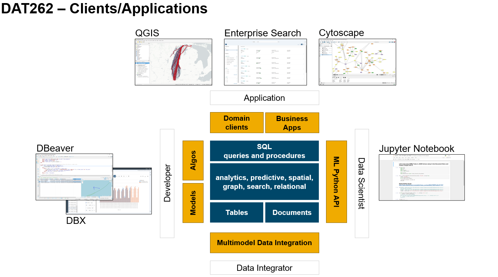

# Getting Started

This section should give you an understanding of the base scenario and data. Additionally, we will describe the SAP HANA Cloud setup in case you want to run the exercises yourself. As we will process the data using SQL, the SQL editor of SAP HANA Database Explorer (DBX) is sufficient from a tooling perspective. However, for the "full experience" we recommend DBeaver, QGIS (or Esri ArcGIS Pro) for spatial data, Cytoscape for graph visualizations, and Python/Jupyter notebooks to work with the SAP HANA client API for machine learning (hana-ml). At the end of this section, you will find links to additional information on SAP HANA Cloud Multi-Model.

## Base Data & Demo Scenario

**Space-time observations**, i.e. geo-locations with a timestamp, are found in many scenarios, e.g. transportation and logistics, health and sports (fitness tracker), public security, environmental analysis. The Automatic Identification System (**AIS**) **vessel data**, that we use in most of the exercises, is a set of such space-time observations. The raw data is collected by the U.S. Coast Guard through an onboard navigation safety device. It can been obtained from [https://marinecadastre.gov/ais/](https://marinecadastre.gov/ais/) and downloaded in form of flat files. The data contains Lon/Lat coordinates, a timestamp, and information about the vessel like its type, name, callsign etc. The granularity of the data has been changing in the recent years. For simplicity reasons, we chose to work with data from 2017 (May and June), covering [UTM Zone 16](https://marinecadastre.gov/AIS/AIS%20Documents/UTMZoneMap2014.png), which includes the area around Lake Michigan. The processing and analysis patterns described in the exercises include

* identifying vessels that went through certain areas,
* deriving motion statistics like speed, acceleration, and heading,
* calculating individual vessel trajectories,
* finding suitable alternative routes in case of a blockage and
* forecasting traffic based on space-time aggregation.

For the second scenario we are using data from [GDLET's Global Entity Graph](https://blog.gdeltproject.org/announcing-the-global-entity-graph-geg-and-a-new-11-billion-entity-dataset/) (GEG). We will load the data into SAP HANA JSON Document Store using hana-ml, and create a graph for relating **POLE entities** (person, organization, location, event) based on their co-occurrence.

## SAP HANA Cloud setup

Most of the exercises and processing patterns can be run on a free SAP HANA Cloud trial system. To get one, visit [SAP HANA Cloud Trial home](https://www.sap.com/cmp/td/sap-hana-cloud-trial.html). To run timeseries forecasting using a PAL algorithm and to work with JSON data using the Document Store, you will need a full SAP HANA Cloud. Make sure to enable the **Script Server** and **Document Store**. Refer to [SAP HANA Cloud Administration with SAP HANA Cloud Central](https://help.sap.com/viewer/9ae9104a46f74a6583ce5182e7fb20cb/hanacloud/en-US/e379ccd3475643e4895b526296235241.html) for details.

The HANA database user you work with requires some roles and privileges
* Roles `AFL__SYS_AFL_AFLPAL_EXECUTE` and `AFL__SYS_AFL_AFLPAL_EXECUTE_WITH_GRANT_OPTION` to execute PAL algorithms
* System privileges `CERTIFICATE ADMIN`, `TRUST ADMIN`, `IMPORT` to prepare and run data uploads from S3
* Object privileges `ESH_CONFIG` and `ESH_SEARCH` for creating search models and running search queries

## DBeaver, QGIS, hana-ml, Cytoscape, and Enterprise Search

The SAP HANA Database Explorer provides an SQL editor, table viewer and data analysis tools, and a simple graph viewer. For a "full experience" we recommend the following tools in addition.

**DBeaver** an open source database administration and development tool. You can run the exercise scripts in DBeaver and get simple spatial visualizations. See Mathias Kemeters blog for [installation instructions](https://blogs.sap.com/2020/01/08/good-things-come-together-dbeaver-sap-hana-spatial-beer/).

**QGIS** an open source Geographical Information System (GIS). QGIS can connect to SAP HANA and provides great tools for advanced maps. Again, read Mathias' blog to [get it up and running](https://blogs.sap.com/2021/03/01/creating-a-playground-for-spatial-analytics/).

**hana-ml**, Jupyter Notebook we used the python machine learning client for SAP HANA and Jupyter Notebooks to load JSON data into the document store. There is a lot more in hana-ml for the data scientist - see [pypi.org](https://pypi.org/project/hana-ml/) and [hana-ml reference](https://help.sap.com/doc/1d0ebfe5e8dd44d09606814d83308d4b/2.0.05/en-US/html/index.html).

**Cytoscape** for advanced graph visualization you can pull data from a Graph Workspace into Cytoscape using an unsupported preview version of the [Cytoscape HANA plug-in](https://blogs.sap.com/2021/09/22/explore-networks-using-sap-hana-and-cytoscape/).

**Enterprise Search** development kit contains a search service and a search UI that can connect to SAP HANA. Refer to the [Enterprise Search Quick Start Guide](https://github.wdf.sap.corp/pages/EnterpriseSearch/getting-started/?rc=1).

##  Background Material

[SAP HANA Spatial Resources](https://blogs.sap.com/2020/11/02/sap-hana-spatial-resources-reloaded/) 
[SAP HANA Graph Resources](https://blogs.sap.com/2021/07/21/sap-hana-graph-resources/) 
[SAP HANA Machine Learning Resources](https://blogs.sap.com/2021/05/27/sap-hana-machine-learning-resources/)

## Summary

You are all set...

Continue to - [Exercise 1 - Prepare the Data](../ex1/README.md)
