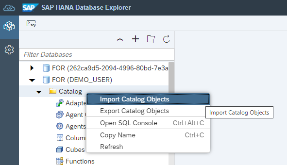
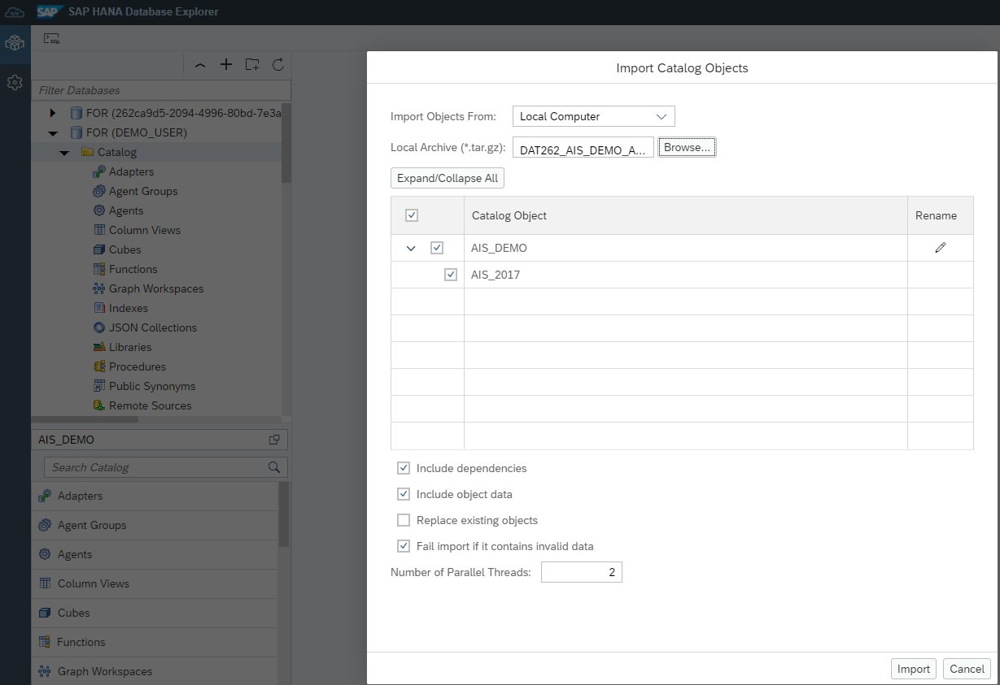
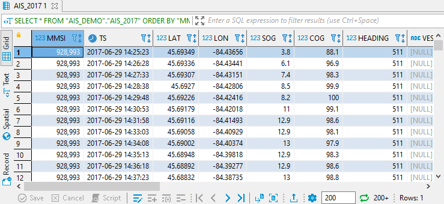
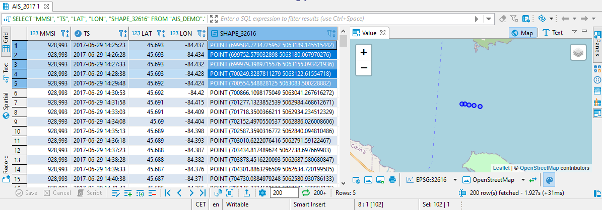

# Exercise 1 - Prepare the Data

In this exercise, we will import the data into a HANA table, do some data transformations and clean-up. The files to import are in the [data_and_script](../data_and_script/) folder:

* DAT262_AIS_DEMO_AIS_2017_05_RAW_BINARY.tar.gz
* DAT262_AIS_DEMO_AIS_2017_06_RAW_BINARY.tar.gz
* DAT262_AIS_DEMO_BOUNDARIES_TEXT.tar.gz

## Import Data<a name="subex1"></a>

We can load the data files into SAP HANA cloud using the Database Explorer. Just right click the `Catalog` node in the tree on the left and choose `Import Database Objects`. In the dialog, browse for "DAT262_AIS_DEMO_AIS_2017_05_RAW_BINARY.tar.gz", wait until the file has been inspected, then hit `IMPORT`.




**Repeat** the import steps for the other two files:
* "DAT262_AIS_DEMO_AIS_2017_06_RAW_BINARY.tar.gz"
*  "DAT262_AIS_DEMO_BOUNDARIES_TEXT.tar.gz".

We had to split the AIS dataset into two files because of file size restrictions on github. We will now merge the data into a single table, so we got all in one place.

````SQL
-- After the import, there are two tables AIS_DEMO.AIS_2017 and AIS_DEMO.AIS_2017_06
SELECT COUNT(*) FROM "AIS_DEMO"."AIS_2017"; --3.7 mio
SELECT COUNT(*) FROM "AIS_DEMO"."AIS_2017_06"; --4.6 mio

-- We copy the data from the second table into the first, so it is all in one place.
INSERT INTO "AIS_DEMO"."AIS_2017" SELECT * FROM "AIS_DEMO"."AIS_2017_06";
SELECT COUNT(*) FROM "AIS_DEMO"."AIS_2017"; --8.4 mio

-- After the copy, we can drop the second table
DROP TABLE "AIS_DEMO"."AIS_2017_06";

-- Some clients like ArcGIS Pro require a primary key, so let's generate one.
ALTER TABLE "AIS_DEMO"."AIS_2017" ADD ("ID" BIGINT GENERATED ALWAYS AS IDENTITY PRIMARY KEY);
````

The raw data after import and merge should look like this.



## Generate Geometries<a name="subex2"></a>

In the table `AIS_DEMO.AIS_2017`, the geo-location is currently encoded by two `DOUBLE` columns `LAT` and `LON`. We will create two geometry columns - one is based on a round-earth spatial reference system (4269), the other one uses a projected system (32616). If you want to learn more about spatial reference systems, see the [SAP HANA Spatial Documentation](https://help.sap.com/viewer/bc9e455fe75541b8a248b4c09b086cf5/2021_3_QRC/en-US/d6aaa035191546c38e06f34b3379496d.html).

```SQL
-- Transform the geo-locations encoded by LAT/LON to a "real" geometry.
-- We will use two spatial reference systems, let's create these.
CREATE PREDEFINED SPATIAL REFERENCE SYSTEM IDENTIFIED BY 4269;
CREATE PREDEFINED SPATIAL REFERENCE SYSTEM IDENTIFIED BY 32616;

-- Add two columns to the data table...
ALTER TABLE "AIS_DEMO"."AIS_2017" ADD ("SHAPE_4269" ST_GEOMETRY(4269));
ALTER TABLE "AIS_DEMO"."AIS_2017" ADD ("SHAPE_32616" ST_GEOMETRY(32616));

-- ... and generate geometries from the LON/LAT values.
UPDATE "AIS_DEMO"."AIS_2017" SET "SHAPE_4269" = ST_GeomFromText('POINT('||LON||' '||LAT||')', 4269);
UPDATE "AIS_DEMO"."AIS_2017" SET "SHAPE_32616" = "SHAPE_4269".ST_Transform(32616);
```

## Remove Duplicates<a name="subex3"></a>

There are duplicates in the raw data. For some timestamps and vessels - identified by "MMSI" (Maritime Mobile Service Identity) - there are two identical records in the data. Let's get rid of these duplicates.

```SQL
-- Check for duplicates, i.e. same vessel, same timestamp
SELECT "MMSI", "TS", COUNT(*) AS C FROM "AIS_DEMO"."AIS_2017" GROUP BY "MMSI", "TS" HAVING COUNT(*) > 1 ORDER BY C DESC;

-- We simply remove the duplicates
DELETE FROM "AIS_DEMO"."AIS_2017" WHERE (MMSI, TS) IN
(
	SELECT "MMSI", "TS" FROM "AIS_DEMO"."AIS_2017" GROUP BY "MMSI", "TS" HAVING COUNT(*) > 1
)
```

The screenshot below shows parts of our table `AIS_2017`. The `MMSI` column contains the key of the vessel, `TS` is the timestamp and `SHAPE_32616` is the point geometry of the observation.



## Summary

We loaded the raw data, generated geometry columns in the table, and did some clean up. We are now ready to work with the data.

Continue to - [Exercise 2 - Identify Vessels within National Park Boundaries](../ex2/README.md)
