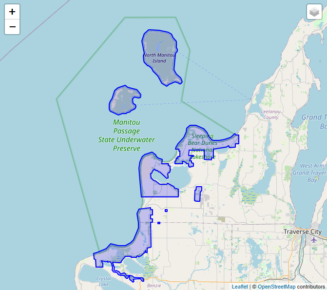
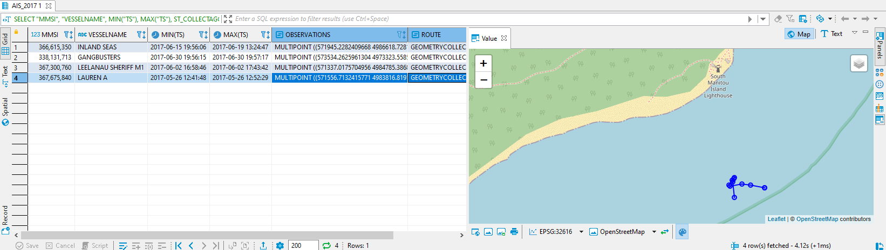

# Exercise 2 - Identify Vessels within National Park Boundaries

In this exercise, we will demonstrate a basic "point in polygon" pattern. At Lake Michigan there is the *Sleeping Bear Dunes National Lakeshore* park (depicted as the blue polygons below). We will run some queries to understand which vessels have crossed the park boundaries.



## Use ST_Within(), ST_MakeLine(), and ST_CollectAggr()<a name="subex1"></a>

Let's query the AIS data for observations that happened within the park boundaries. We can use the `ST_Within()` predicate as a join condition, checking if an AIS record is within the parks' boundary. relating the AIS table to the table which contains the park polygon.

```SQL
-- How many AIS observations and distinct vessels are located within the park boundaries?
SELECT COUNT(*), COUNT(DISTINCT "MMSI")
FROM "AIS_DEMO"."AIS_2017" AS D, "AIS_DEMO"."PARK_BOUNDARIES" AS B
WHERE D."SHAPE_32616".ST_Within(B."SHAPE_32616") = 1;
```

Running the above queries tells us that there are 524 AIS observations from 4 ships. Let's take a closer look and understand the time these 4 vessels spent within the park boundaries. We will also construct a simple route from these observation by
<ol><li>ordering the AIS observations by time using a window function</li>
<li>creating a linestring for each pair of consecutive points using ST_MakeLine()</li>
<li>aggregating the linestrings into a single geometry using ST_CollectAggr()</li></ol>

```SQL
-- Which vessels and when? Get the single point observations and construct a simple route.
SELECT "MMSI", "VESSELNAME", MIN("TS"), MAX("TS"), ST_COLLECTAGGR("SHAPE_32616") AS "OBSERVATIONS", ST_COLLECTAGGR("LINE_32616") AS "ROUTE" FROM (
	SELECT D."MMSI", D."TS", D."VESSELNAME", D."SHAPE_32616",
		ST_MAKELINE(LAG(D."SHAPE_32616", 1) OVER(PARTITION BY "MMSI" ORDER BY "TS"), D."SHAPE_32616") AS "LINE_32616"
	FROM "AIS_DEMO"."AIS_2017" AS D, "AIS_DEMO"."PARK_BOUNDARIES" AS B
	WHERE D."SHAPE_32616".ST_Within(B."SHAPE_32616") = 1
) GROUP BY "MMSI", "VESSELNAME";
```
So, we can see that "Lauren A" has been cruising within the park area between 12:42 and 12:52. The aggregation of the point geometries reveals the approximate route.
<br>

## Summary

We have seen how to use a basic spatial predicate (ST_Within()) to join two tables. For constructing a route from point observations we have seen how to use ST_MakeLine() to connect each point to its successor.

Continue to - [Exercise 3 - Understand Vessel Motion](../ex3/README.md)
