# Exercise 3 - Understand Vessel Motion

In the last exercise we have seen how to construct a path from point observations using `ST_MakeLine()`. We will now extend this query pattern to also calculate motion statistics like **speed** and **acceleration**. Next we will take a look at individual trajectories of cargo and passenger ships before we identify **dwell locations**, i.e. when ships stop for a period of time before starting the next trip segment.

## Derive Speed, Acceleration, Total Distance, and Total Time<a name="subex1"></a>

We will calculate the basic motion statistics in three steps, using three stacked SQL views for better understanding. In sequence, we will calculate
1. the time interval and distance between each pair of consecutive vessel observations: `DELTA_S` and `DELTA_T`
2. from `DELTA_S` and `DELTA_T` we will derive the vessel's speed and sum up time and distance
3. looking at the change in speed, we can calculate acceleration

All the views below make use of window functions where the data is partitioned by `MMSI` (used as the vessel identifier) and ordered by timestamp. In specific, we will use `RANK()` which returns an order number, and `LAG()` which provides access to the next record in the ordered partition. Refer to the [HANA Cloud SQL documentation](https://help.sap.com/viewer/7c78579ce9b14a669c1f3295b0d8ca16/Cloud/en-US/20a353327519101495dfd0a87060a0d3.html) for further details.

```SQL
-- Step 1: delta s, delta t, ranks, partial lines
CREATE OR REPLACE VIEW "AIS_DEMO"."V_MOTION_STATS_1" AS (
	SELECT "MMSI", "SHAPE_32616" AS "P", "TS",
		CAST("SHAPE_32616".ST_DISTANCE(LAG("SHAPE_32616", 1) OVER(PARTITION BY "MMSI" ORDER BY "TS"), 'meter') AS DECIMAL(10,2)) AS "DELTA_S",
		SECONDS_BETWEEN(LAG("TS", 1) OVER(PARTITION BY "MMSI" ORDER BY "TS"), "TS") AS "DELTA_T",
		ST_MAKELINE(LAG("SHAPE_32616", 1) OVER(PARTITION BY "MMSI" ORDER BY "TS"), "SHAPE_32616") AS "LINE_32616",
		RANK() OVER(PARTITION BY "MMSI" ORDER BY "TS") AS "FWD_RANK",
		RANK() OVER(PARTITION BY "MMSI" ORDER BY "TS" DESC) AS "BWD_RANK"
	FROM "AIS_DEMO"."AIS_2017"
	WHERE "MMSI" = 366780000 AND "TS" BETWEEN '2017-06-24 10:00:00' AND '2017-06-25 10:00:00'
);
SELECT * FROM "AIS_DEMO"."V_MOTION_STATS_1" ORDER BY "TS" ASC;
```

The view above calculates forward and backward rank, the time interval and distance ("DELTA_T" and "DELTA_S") between consecutive observations, and generates a linestring which connects the points. For simplicity reasons, we are analyzing a single ship's ("MMSI" = 366780000) movement in a 24h interval. We see that the time interval between two AIS signals is about 70 seconds and the distance is greater than 200 meters at first, but then drops below 200 meters around 10:12.

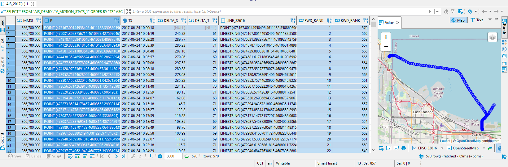

The next piece of logic calculates the speed in m/s, dividing `DELTA_S` by `DELTA_T`, and sums up `DELTA_S` and `DELTA_T` so we understand how long and how far a ship has travelled up to that point.

```SQL
-- Step 2: sum up delta s and delta t, calculate speed
CREATE OR REPLACE VIEW "AIS_DEMO"."V_MOTION_STATS_2" AS (
	SELECT SUM("DELTA_S") OVER(PARTITION BY "MMSI" ORDER BY "TS" ASC) AS "TOTAL_DISTANCE",
			SUM("DELTA_T") OVER(PARTITION BY "MMSI" ORDER BY "TS" ASC) AS "TOTAL_TIMESPAN",
			"DELTA_S"/"DELTA_T" AS "SPEED_M/S", *
		FROM "AIS_DEMO"."V_MOTION_STATS_1"
);
SELECT * FROM "AIS_DEMO"."V_MOTION_STATS_2" ORDER BY "TS" ASC;
```
The second view above adds `TOTAL_DISTANCE`, `TOTAL_TIMESPAN`, and `SPEED_M/S`. Looking at line 11 we see that the ship has travelled 2714 meter in 690 seconds, running with a current speed of 3.345 m/sec.

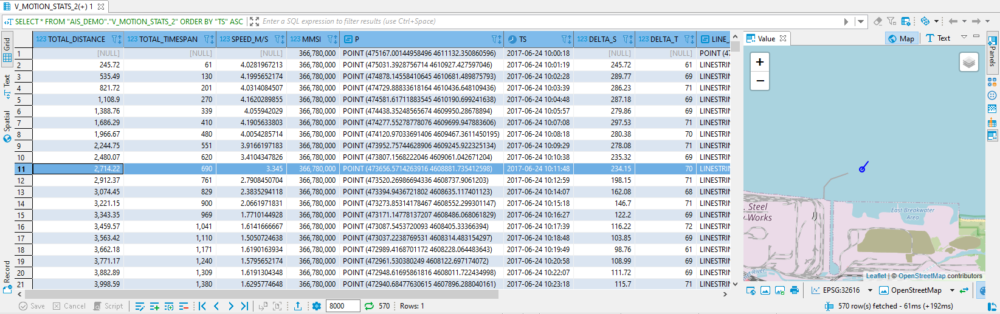

In the last step, we calculate the acceleration, dividing the change in speed by the time interval.

```SQL
-- Step 3: calculate acceleration
CREATE OR REPLACE VIEW "AIS_DEMO"."V_MOTION_STATS_3" AS (
	SELECT  ("SPEED_M/S"-LAG("SPEED_M/S", 1) OVER(PARTITION BY "MMSI" ORDER BY "TS" ASC))/("DELTA_T") AS "ACCELERATION", *
		FROM "AIS_DEMO"."V_MOTION_STATS_2"
);
SELECT * FROM "AIS_DEMO"."V_MOTION_STATS_3" ORDER BY "TS" ASC;
```
So, looking at the first column in the table below we see the ship is decelerating (negative values) when approaching the harbor, reducing the speed from 3.4 m/sec to 1.6 m/sec.

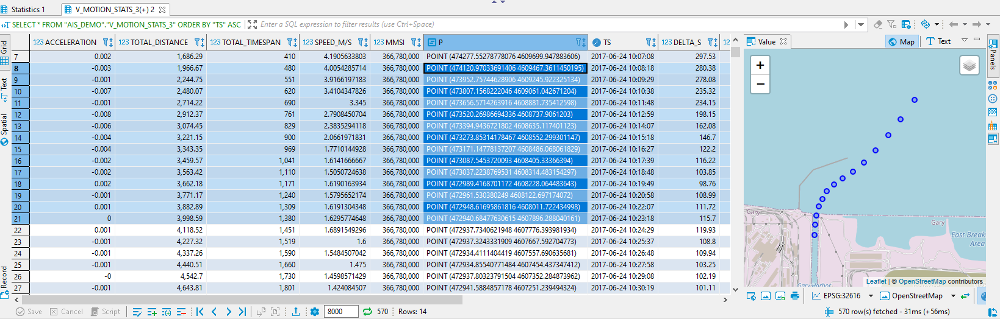

Next, we will wrap the logic of the three SQL views above into a single user-defined function. This will allow very flexible filtering - we can simply pass a valid WHERE condition in the parameter "i_filter". This filter is applied on our `AIS_2017` table using the `APPLY_FILTER()` function (... strange name for this function, do you agree?). The filtered data `DAT` is the data on which we run our motion statistics logic. The resulting dataset `MS` is then returned by the function.

```SQL
-- Now, let's wrap the 3-step logic of the SQL views above into a single function
CREATE OR REPLACE FUNCTION "AIS_DEMO"."F_MOTION_STATS" (IN i_filter NVARCHAR(5000))
RETURNS TABLE ("MMSI" INT, "TS" TIMESTAMP, "TOTAL_DISTANCE" DECIMAL(10,2), "TOTAL_TIMESPAN" DECIMAL(10,2), "SPEED_M/S" DECIMAL(10,2), "ACCELERATION" DECIMAL(10,3),
	"LINE_32616" ST_GEOMETRY(32616),
	"SOG" REAL, "COG" REAL, "VESSELNAME" NVARCHAR(500), "VESSELTYPE" INT, "CARGO" INTEGER, "SHAPE_32616" ST_GEOMETRY(32616), "ID" BIGINT,
	"FWD_RANK" INT, "BWD_RANK" INT, "DELTA_T" INT, "DELTA_S" DECIMAL(10,2),
	"DATE" DATE, "WEEKDAY" INT, "HOUR" INT)
AS BEGIN
	DAT = APPLY_FILTER("AIS_DEMO"."AIS_2017", :i_filter);
	MS = SELECT *, CAST(("SPEED_M/S"-LAG("SPEED_M/S", 1) OVER(PARTITION BY "MMSI" ORDER BY "TS" ASC))/("DELTA_T") AS DECIMAL(10,3)) AS "ACCELERATION"
		FROM (
			SELECT	CAST(SUM("DELTA_S") OVER(PARTITION BY "MMSI" ORDER BY "TS" ASC) AS DECIMAL(10,2)) AS "TOTAL_DISTANCE",
					CAST(SUM("DELTA_T") OVER(PARTITION BY "MMSI" ORDER BY "TS" ASC) AS DECIMAL(10,2)) AS "TOTAL_TIMESPAN",
					CAST("DELTA_S"/("DELTA_T") AS DECIMAL(10,2)) AS "SPEED_M/S",
					TO_DATE("TS") AS "DATE", WEEKDAY("TS") AS "WEEKDAY", HOUR("TS") AS "HOUR", *
				FROM (
					SELECT "MMSI", "VESSELNAME", "VESSELTYPE", "CARGO", "ID", "SHAPE_32616", "TS", "SOG", "COG",
						ST_MAKELINE(LAG("SHAPE_32616", 1) OVER(PARTITION BY "MMSI" ORDER BY "TS"), "SHAPE_32616") AS "LINE_32616",
						RANK() OVER(PARTITION BY "MMSI" ORDER BY "TS") AS "FWD_RANK",
						RANK() OVER(PARTITION BY "MMSI" ORDER BY "TS" DESC) AS "BWD_RANK",
						CAST("SHAPE_32616".ST_DISTANCE(LAG("SHAPE_32616", 1) OVER(PARTITION BY "MMSI" ORDER BY "TS"), 'meter') AS DECIMAL(10,2)) AS "DELTA_S",
						SECONDS_BETWEEN(LAG("TS", 1) OVER(PARTITION BY "MMSI" ORDER BY "TS"), "TS") AS "DELTA_T"
					FROM :DAT
				)
		);
	RETURN SELECT "MMSI", "TS", "TOTAL_DISTANCE", "TOTAL_TIMESPAN", "SPEED_M/S", "ACCELERATION", "LINE_32616", "SOG", "COG", "VESSELNAME", "VESSELTYPE", "CARGO",
		"SHAPE_32616", "ID", "FWD_RANK", "BWD_RANK", "DELTA_T", "DELTA_S", "DATE", "WEEKDAY", "HOUR"
		FROM :MS
		ORDER BY "MMSI", "FWD_RANK";
END;

-- Let's inspect some motion statistics. The string parameter needs to be a valid SQL WHERE condition on the table "AIS_DEMO"."AIS_2017"
SELECT * FROM "AIS_DEMO"."F_MOTION_STATS"(' "MMSI" = 366780000 AND "TS" BETWEEN ''2017-06-24 10:00:00'' AND ''2017-06-25 10:00:00'' ');
SELECT * FROM "AIS_DEMO"."F_MOTION_STATS"(' "VESSELTYPE" = 1004 AND "TS" BETWEEN ''2017-06-01 00:00:00'' AND ''2017-06-07 23:00:00'' ');
```

Here is a how the motion statistics could be visualized in QGIS. The first screenshot shows a vessel's speed (red=fast, blue=slow) observed in a 3 hour interval. The second screenshot visualizes "traces" of vessels. The more transparent the line is, the more the observations happened in the past.

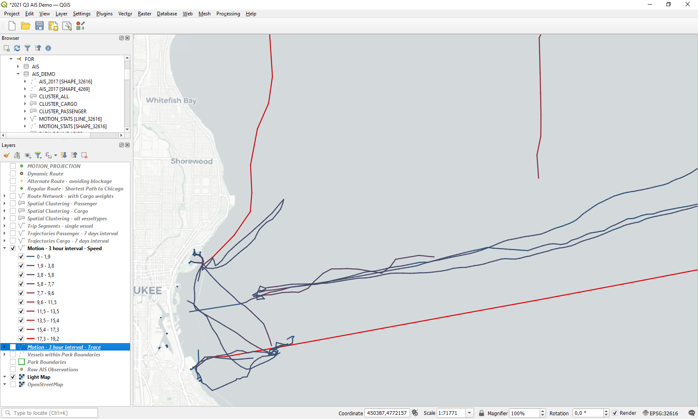
<br><br>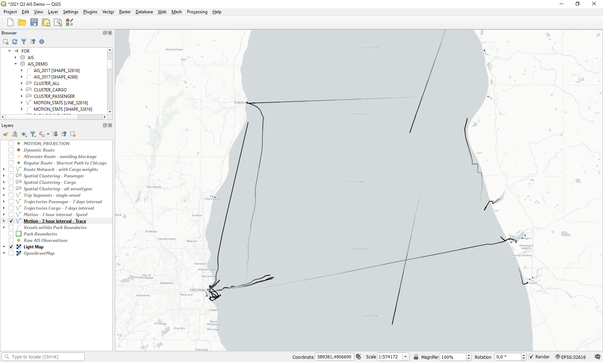

As an alternative, we can plot `SPEED_M/S` and `TOTAL_DISTANCE` over time directly in SAP HANA Database Explorer. We see two longer and a shorter period with high speed (peaks in the blue line). Accordingly, the orange line indicates total distance.

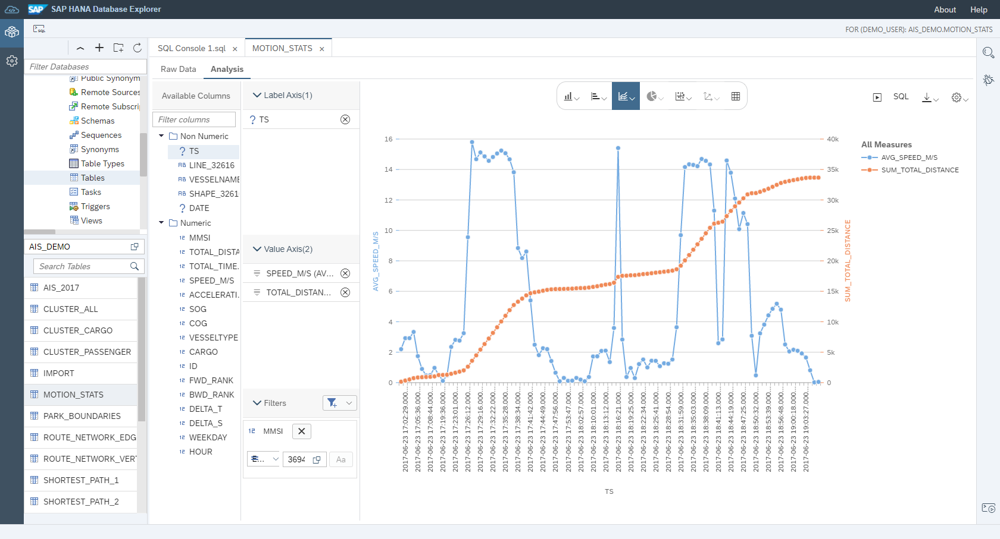

We can use the user-defined function `F_MOTION_STATS` as sub-query or derive additional statistics from the result. The below query for example takes the fine granular motion statistics and calculates hourly average and maximum of speed for a 7 day interval.
```SQL
SELECT HOUR("TS"), COUNT(*), COUNT(DISTINCT "MMSI"), AVG("SPEED_M/S"), MAX("SPEED_M/S")
	FROM "AIS_DEMO"."F_MOTION_STATS"(' "TS" BETWEEN ''2017-06-01 00:00:00'' AND ''2017-06-07 24:00:00'' ') WHERE "SPEED_M/S" > 0.5
	GROUP BY HOUR("TS")
	ORDER BY HOUR("TS");
```
We can see that the average speed is highest (4.7 and 4.8 m/sec) in the early PMs, but the maximum speed was observed between 10PM and midnight (>30 m/sec).

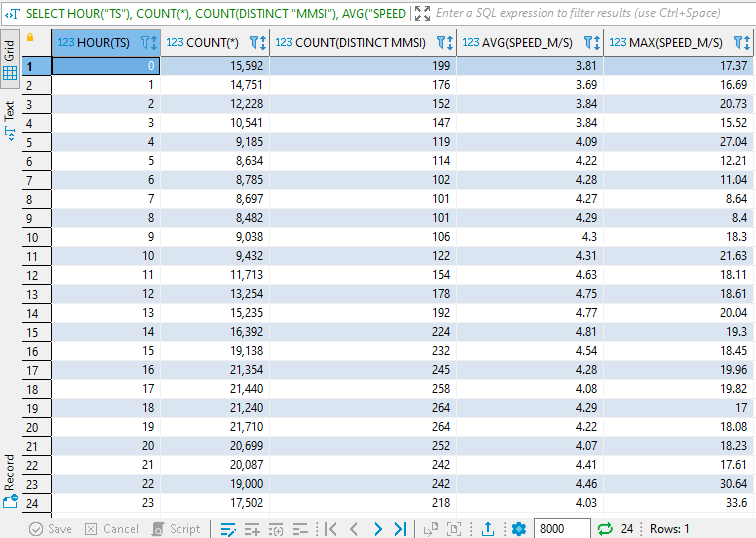

## Vessel Trajectories<a name="subex2"></a>

In the last exercise, we generated a vessel's trajectory or route by simply aggregating individual 2-point linestrings into a geometry collection using `ST_CollectAggr()`. For pure visualization purposes this might be good enough - QGIS doesn't care if you want it to render a collection of 1000 lines with just a start and an end point, or to render a single linestring with 500 supporting points. However, it is much more appropriate to calculate trajectories as a single geometry based on supporting points with measures, or "M" values. For our vessel trajectories a natural choice for "M" is a timestamp-like measure - we simply take the seconds between the beginning of our dataset and the actual observation.
A convenient way to construct a linestring from a set of points is to use the `STRING_AGG` function to generate a Well Known Text (WKT) string from which we can construct a geometry. The query below takes the result of the motion statistics table function for 5 vessels, and generates a linestring for each vessel.

```SQL
SELECT "MMSI", ST_GeomFromText(
		'LineString M('||STRING_AGG(TO_NVARCHAR("SHAPE_32616".ST_X()||' '||"SHAPE_32616".ST_Y()||' '||SECONDS_BETWEEN('2017-05-01 00:00:00', "TS")), ',' ORDER BY "FWD_RANK")||')'
		, 32616)
	FROM "AIS_DEMO"."F_MOTION_STATS"(' "MMSI" IN (367706320, 367909800, 367730240, 366780000, 314084000) AND TS BETWEEN ''2017-06-02 5:00:00'' AND ''2017-06-03 7:00:00'' ')
	GROUP BY "MMSI"
	HAVING COUNT(*)>2;
```

The screenshot below visualizes the linestring that represents the trajectory of a ferry.

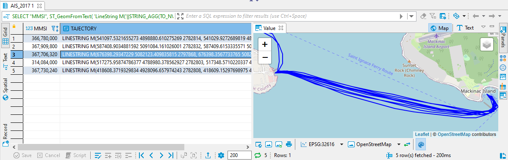

In a similar way we can generate the trajectories of cargo ships in a 7 day interval - different colors indicate different vessels.

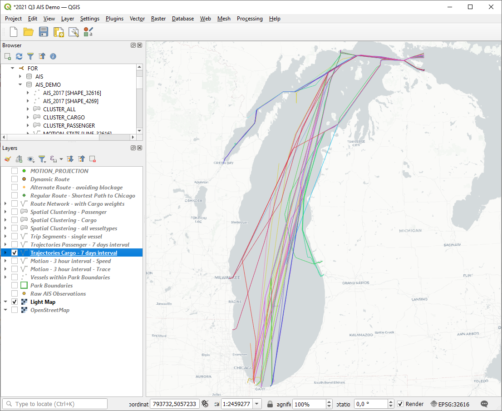

... and the same for passenger ships.

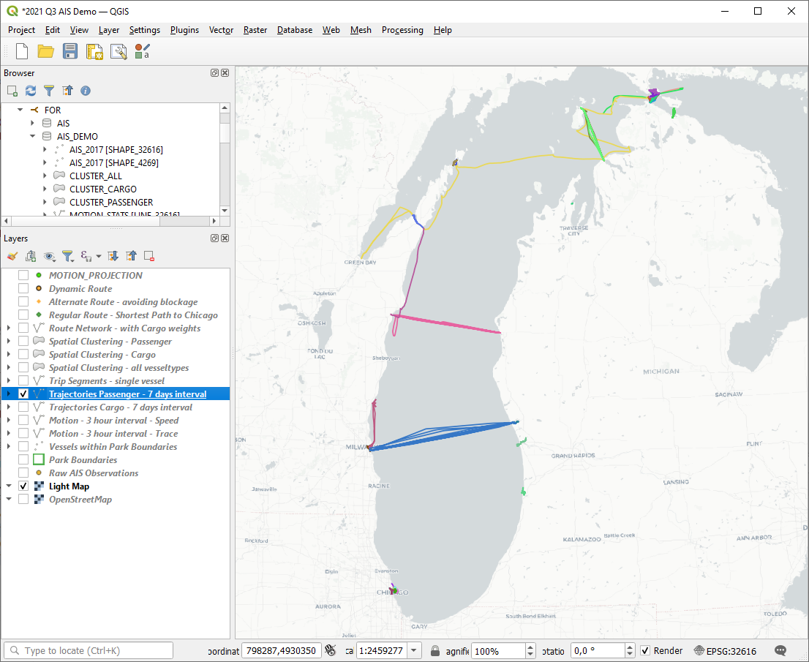

## Dwell Locations and Trip Segments<a name="subex3"></a>

The blue line of the passenger ship in the screenshot above tells us that this ship is going back and forth between the Milwaukee and Muskegon. In this section we want to subdivide the trajectory into individual trip segments, i.e. identify dwell locations. We will basically inspect a sliding window of *n* minutes to find intervals with no or minimal motion. Knowing these "no motion" intervals allows us to split the trajectory into segments.
In the end, we will create a single table function detecting trip segments, but first we will create five stacked views to explain the logic.
1. We create sliding windows, joining each observation to the ones within the previous n minutes
2. We then check the sum of the distances between the observations in a window - if less than 100 m, we assign a 'no motion' flag
3. Next, we identify *changes in motion* by comparing each observation to the previous one
4. The change flags are used to subdivide the trajectory into segments
5. Finally, we aggregate the observations by segment

### 1 Sliding Windows

```SQL
-- Step 1: sliding windows
CREATE OR REPLACE VIEW "AIS_DEMO"."V_DWELL_LOC_1_DIST" AS (
	-- get some data from the AIS_2017 table, calculate the distance to previous observation
	WITH DAT AS (
		SELECT "MMSI", "TS", "SHAPE_32616",
			"SHAPE_32616".ST_DISTANCE(LAG("SHAPE_32616", 1) OVER(PARTITION BY "MMSI" ORDER BY "TS"), 'meter') AS "DIST_TO_PREV",
			ST_MakeLine(LAG("SHAPE_32616", 1) OVER(PARTITION BY "MMSI" ORDER BY "TS"), "SHAPE_32616") AS "LINE_32616"
			FROM "AIS_DEMO"."AIS_2017"
			WHERE "MMSI" = 367909800 AND "TS" BETWEEN '2017-06-1 15:30:00' AND '2017-06-2 24:00:00'
		)
	SELECT T1."MMSI", T1."TS", T1."SHAPE_32616", T1."LINE_32616", T2."TS" AS "TS2", T2."SHAPE_32616" AS "SHAPE_32616_2", T2."DIST_TO_PREV",
		-- we just take the distances within each sliding window, so the oldest element adds a distance=0 to the sum
		CASE WHEN LAG(T1."TS", 1) OVER (PARTITION BY T1."MMSI", T1."TS" ORDER BY T2."TS") = T1."TS"
			THEN T2."DIST_TO_PREV"
			ELSE 0
			END AS "DIST"
		FROM DAT AS T1
		LEFT JOIN DAT AS T2
			-- every observation is joined to observations that occurred up to 5*60 seconds in the past
			ON T1."TS" BETWEEN T2."TS" AND ADD_SECONDS(T2."TS", 5*60) AND T1."MMSI" = T2."MMSI"
);

SELECT "MMSI", "TS", "TS2", "SHAPE_32616_2", "DIST_TO_PREV", "DIST"
	FROM "AIS_DEMO"."V_DWELL_LOC_1_DIST"
	ORDER BY "MMSI", "TS", "TS2";
```

Query 1 above returns for each observation (see the highlighted one below at 16:53:03) the previous ones up 5 minutes (see column "TS2" - ranging from 16:48:48 to 16:53:03). `DIST_TO_PREV` contains the spatial distance to the previous observation (17 - 51 meters). We are only interested in the four distances *between* the observations WITHIN one window - this is why "DIST" is 0 for the oldest element in the window (line 356).

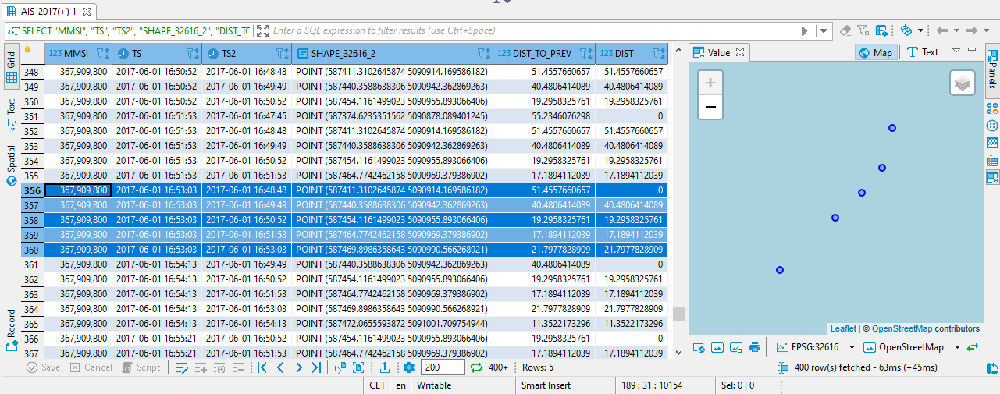

### 2 Sum up Distances, Motion

```SQL
-- Step 2: Summing up distances
CREATE OR REPLACE VIEW "AIS_DEMO"."V_DWELL_LOC_2_DIST" AS (
	-- if the sum of the distances between the observation in the last 5 minutes is lower that 100m, we consider this a "no motion" interval
	SELECT *, CASE WHEN "SUM_DIST" < 100 THEN 'no motion' ELSE 'motion' END AS "MOTION" FROM (
		SELECT "MMSI", "TS", "SHAPE_32616", "LINE_32616", COUNT(*) AS "NUM_OBS_IN_INTERVAL", SUM("DIST") AS "SUM_DIST"
			FROM "AIS_DEMO"."V_DWELL_LOC_1_DIST"
			GROUP BY "MMSI", "TS", "SHAPE_32616", "LINE_32616"
			-- we require to have at least 3 observations in the 5 minute interval
			HAVING COUNT(*) >=3
	)
);
SELECT "MMSI", "TS", "SHAPE_32616", "NUM_OBS_IN_INTERVAL", "SUM_DIST", "MOTION"
	FROM "AIS_DEMO"."V_DWELL_LOC_2_DIST"
	ORDER BY "MMSI", "TS" ASC;
```

Query 2 above aggregates the windows. For our observation at 16:53:03 we see that there are 5 observations in the last 5 minutes, resulting in a cumulative distance of 98.7m. Since this is below the threshold (100m), the flag is set to "no motion".

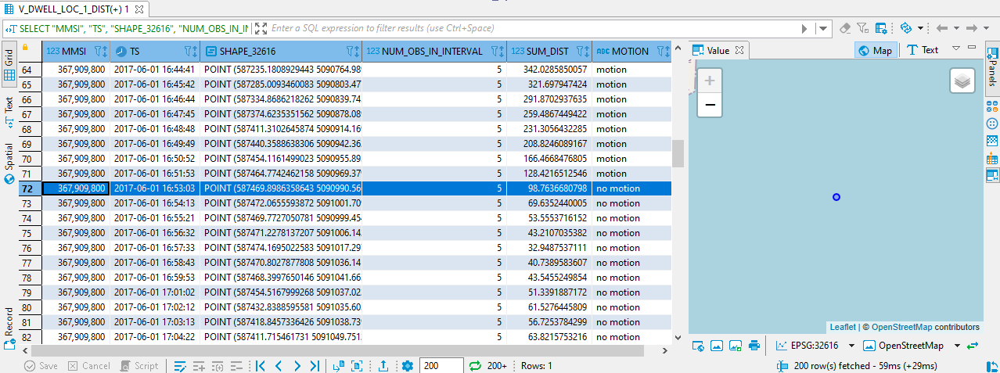

### 3 Motion Change

```SQL
-- Step 3: identify changes in motion
CREATE OR REPLACE VIEW "AIS_DEMO"."V_DWELL_LOC_3_DIST" AS (
	SELECT CASE
		WHEN LAG("MOTION", 1) OVER(PARTITION BY "MMSI" ORDER BY "TS") != "MOTION" AND "MOTION" = 'no motion' THEN 'stopped'
		WHEN LAG("MOTION", 1) OVER(PARTITION BY "MMSI" ORDER BY "TS") != "MOTION" AND "MOTION" = 'motion' THEN 'started'
		END AS "MOTION_CHANGE", *
		FROM "AIS_DEMO"."V_DWELL_LOC_2_DIST"
);
SELECT "MMSI", "TS", "MOTION", "MOTION_CHANGE", "SHAPE_32616"
	FROM "AIS_DEMO"."V_DWELL_LOC_3_DIST"
	ORDER BY "MMSI", "TS" ASC;
```

As the `MOTION` flag changes from 'motion' to 'no motion' at 16:53:03 we set a `MOTION_CHANGE` flag 'stopped'.

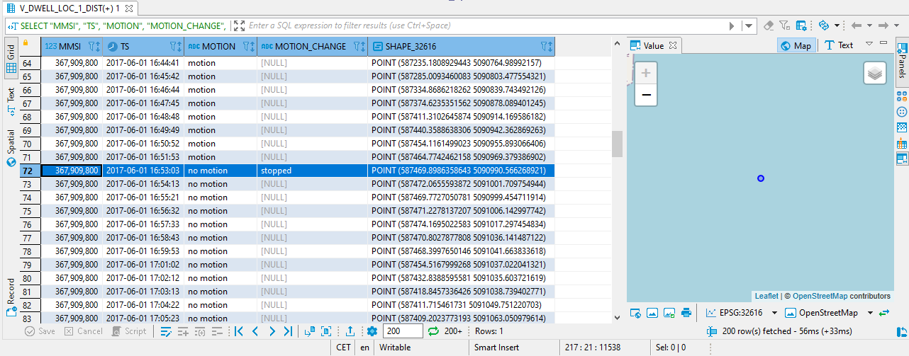

### 4 Trip Segments

```SQL
-- Step 4: segment trips using motion change markers
CREATE OR REPLACE VIEW "AIS_DEMO"."V_DWELL_LOC_4_DIST" AS (
	SELECT COUNT("MOTION_CHANGE") OVER (PARTITION BY "MMSI" ORDER BY "TS") AS "TRIP_SEGMENT", *
		FROM "AIS_DEMO"."V_DWELL_LOC_3_DIST"
);
SELECT "MMSI", "TS", "MOTION", "MOTION_CHANGE", "TRIP_SEGMENT", "SHAPE_32616"
	FROM "AIS_DEMO"."V_DWELL_LOC_4_DIST"
	ORDER BY "MMSI", "TS" ASC;
```
In step 4 we just count the `MOTION_CHANGE` markers to generate a `TRIP_SEGMENT` number. At 16:53:03 trip segment 1 begins.

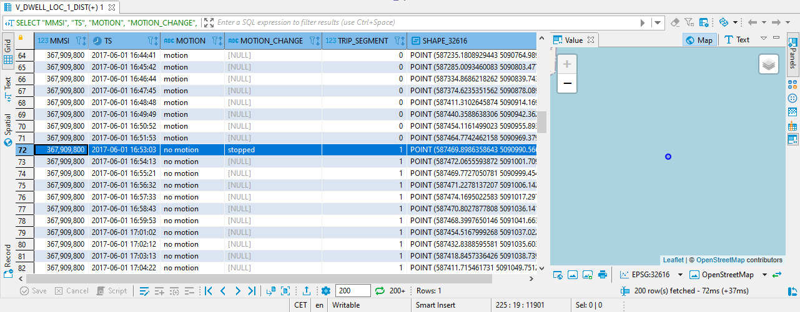

### 5 Aggregation by Segment

```SQL
-- Step 5: aggregate observations by trip segment
CREATE OR REPLACE VIEW "AIS_DEMO"."V_DWELL_LOC_5_DIST" AS (
	SELECT "MMSI", MIN("TS") AS "SEGMENT_START", MAX("TS") AS "SEGMENT_END", MAX("MOTION") AS "MOTION", MIN("SUM_DIST") AS "MIN_DIST", MAX("SUM_DIST") AS "MAX_DIST",
			COUNT(*) AS "NUM_OBS_IN_INTERVAL", "TRIP_SEGMENT", ST_COLLECTAGGR("SHAPE_32616") AS "SHAPE_32616", ST_COLLECTAGGR("LINE_32616") AS "LINE_32616"
		FROM "AIS_DEMO"."V_DWELL_LOC_4_DIST"
		GROUP BY "MMSI", "TRIP_SEGMENT"
);
SELECT * FROM "AIS_DEMO"."V_DWELL_LOC_5_DIST" ORDER BY "MMSI", "TRIP_SEGMENT" ASC;
```

In the last step we simply sum up some values by trip segment. Line 2 contains the values for the 'no motion' segment that starts at 16:53:03. There are 651 observation in that segment, with a maximum of 98.7m cumulative motion distance within 5 minutes.

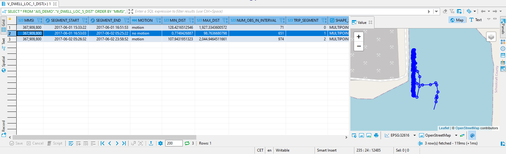

### Steps 1-5 in a single table function

We can wrap the 5 individual steps from above into a single table function, so we can call it in the same flexible manner as our motion statistics in the first section.

```SQL
-- Wrap steps 1-5 in a function, so we can call it with a filter clause
CREATE OR REPLACE FUNCTION "AIS_DEMO"."F_TRIP_SEGMENTS_DIST" (IN i_filter NVARCHAR(5000), IN i_intervalMin INT, IN i_distanceThreshold DOUBLE)
RETURNS TABLE ("MMSI" INT, "SEGMENT_START" TIMESTAMP, "SEGMENT_END" TIMESTAMP, "MOTION" NVARCHAR(10), "MIN_DIST" DOUBLE, "MAX_DIST" DOUBLE, "C" INT,
	"TRIP_SEGMENT" INT, "SHAPE_32616" ST_GEOMETRY(32616), "LINE_32616" ST_GEOMETRY(32616))
AS BEGIN
	DAT1 = APPLY_FILTER("AIS_DEMO"."AIS_2017", :i_filter);
	DAT = SELECT *, ST_MakeLine(LAG("SHAPE_32616", 1) OVER(PARTITION BY "MMSI" ORDER BY "TS"), "SHAPE_32616") AS "LINE_32616", "SHAPE_32616".ST_DISTANCE(LAG("SHAPE_32616", 1) OVER(PARTITION BY "MMSI" ORDER BY "TS"), 'meter') AS "DIST_TO_PREV" FROM :DAT1;
	RES = 	SELECT "MMSI", MIN("TS") AS "SEGMENT_START", MAX("TS") AS "SEGMENT_END", MAX("MOTION") AS "MOTION", MIN("SUM_DIST") AS "MIN_DIST", MAX("SUM_DIST") AS "MAX_DIST",
		COUNT(*) AS C, "TRIP_SEGMENT", ST_COLLECTAGGR("SHAPE_32616") AS "SHAPE_32616", ST_COLLECTAGGR("LINE_32616") AS "LINE_32616"
		FROM (
			SELECT COUNT("MOTION_CHANGE") OVER (PARTITION BY "MMSI" ORDER BY "TS") AS "TRIP_SEGMENT", *
				FROM (
					SELECT CASE
						WHEN LAG("MOTION", 1) OVER(PARTITION BY "MMSI" ORDER BY "TS") != "MOTION" AND "MOTION" = 'no motion' THEN 'stopped'
						WHEN LAG("MOTION", 1) OVER(PARTITION BY "MMSI" ORDER BY "TS") != "MOTION" AND "MOTION" = 'motion' THEN 'started'
						END AS "MOTION_CHANGE", *
						FROM (
							SELECT *, CASE WHEN "SUM_DIST" < :i_distanceThreshold THEN 'no motion' ELSE 'motion' END AS "MOTION" FROM (
								SELECT "MMSI", "TS", "SHAPE_32616", "LINE_32616", COUNT(*), SUM("DIST") AS "SUM_DIST"
									FROM (
										SELECT T1."MMSI", T1."TS", T1."SHAPE_32616", T1."LINE_32616",
											CASE WHEN LAG(T1."TS", 1) OVER (PARTITION BY T1."MMSI" ORDER BY T1."TS", T2."TS") = T1."TS"
												THEN T2."DIST_TO_PREV"
												ELSE 0
												END AS "DIST"
											FROM :DAT AS T1
											LEFT JOIN :DAT AS T2
												ON T1."TS" BETWEEN T2."TS" AND ADD_SECONDS(T2."TS", :i_intervalMin*60) AND T1."MMSI" = T2."MMSI"
									)
									GROUP BY "MMSI", "TS", "SHAPE_32616", "LINE_32616"
									HAVING COUNT(*) >=3
							)
						)
				)
		)
	GROUP BY "MMSI","TRIP_SEGMENT";
	RETURN SELECT * FROM :RES;
END;

SELECT * FROM "AIS_DEMO"."F_TRIP_SEGMENTS_DIST"(' "MMSI" = 367341010 ', 8, 80);
```

The QGIS map below display the analysis for a single vessel's two months of motion. The different colors indicate different trip segments.

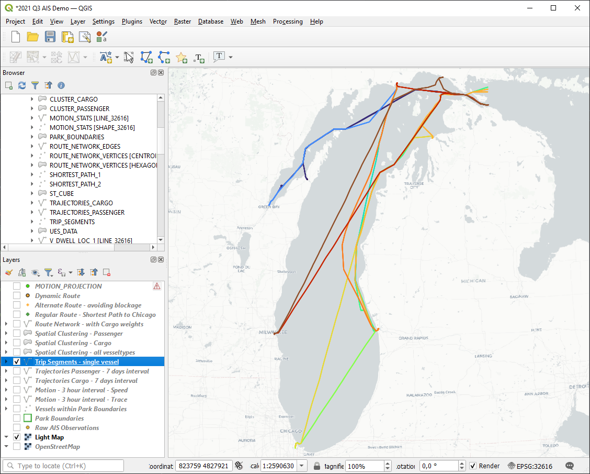

## Summary

A lot of code in the exercise... we have seen how to calculate motion statistics like speed and acceleration from raw AIS observations, and how to concatenate trajectories from the sequence of points. Finally, we have examined the logic for finding dwell/stop locations and trip segmentation.

Continue to - [Exercise 4 - Spatial Clustering ](../ex4/README.md)
