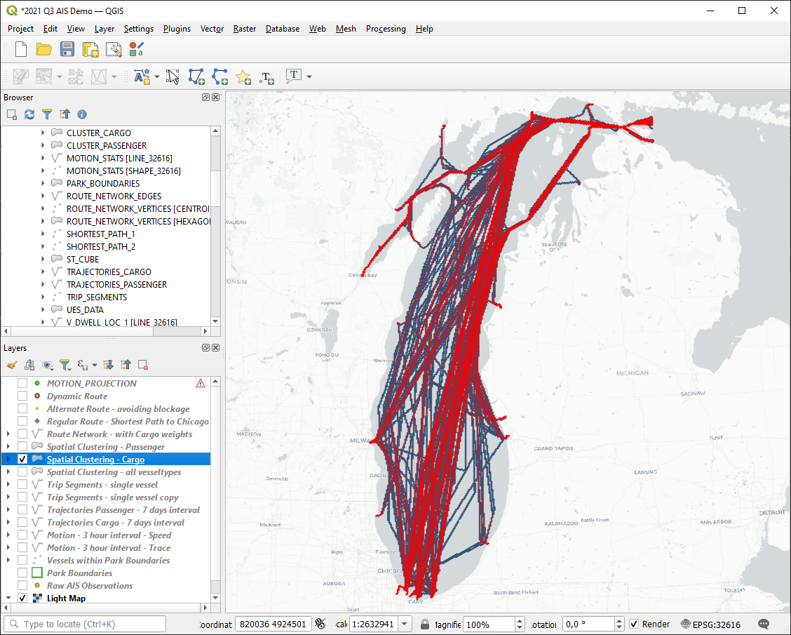
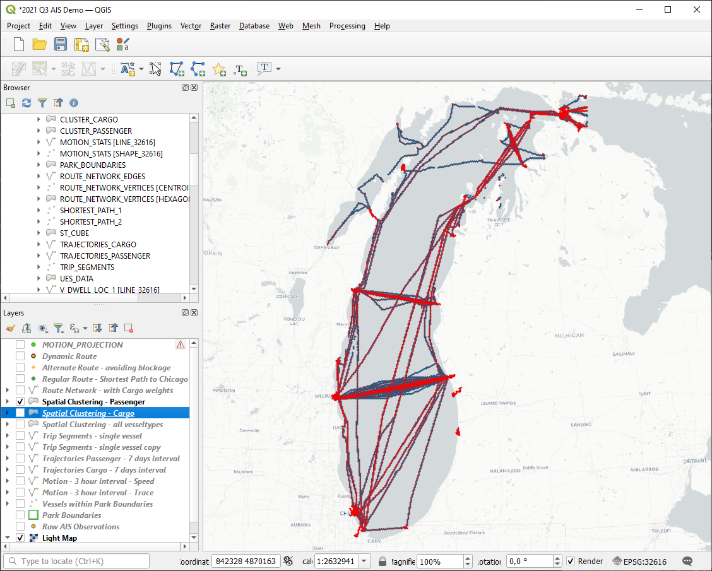

# Exercise 4 - Spatial Clustering

In this exercise, we will use spatial clustering techniques to understand density and spatial distribution of AIS observations.
There a some techniques to cluster points - (rectangular) grid, hexagon, DBScan, and KMeans. See the [SAP HANA Cloud Spatial Reference](https://help.sap.com/viewer/bc9e455fe75541b8a248b4c09b086cf5/2021_3_QRC/en-US/7eb3c0e6bbf04fc6bcb9809d81533e6f.html) for details. For all variants, there is a native SQL syntax: `GROUP CLUSTER BY`. For hexagon clustering with 400 cells in Y direction the statement looks like this:

```SQL
SELECT ST_CLUSTERID() AS "ID", ST_CLUSTERCELL() AS "SHAPE", COUNT(*) AS C, COUNT(DISTINCT "MMSI") AS "SHIPS"
	FROM "AIS_DEMO"."AIS_2017"
	GROUP CLUSTER BY "SHAPE_32616" USING HEXAGON Y CELLS 400;
```

We can use spatial clusters to understand the density of cargo vessel observations. Let's store this data in a table.

````SQL
-- Create a table to store the result for CARGO vessels
CREATE COLUMN TABLE "AIS_DEMO"."CLUSTER_CARGO" (
	"ID" INT PRIMARY KEY,
	"SHAPE_32616" ST_GEOMETRY(32616),
	"C" INT,
	"SHIPS" INT,
	"SOG" DOUBLE
);
SELECT ST_CLUSTERID() AS "ID", ST_CLUSTERCELL() AS "SHAPE", COUNT(*) AS C, COUNT(DISTINCT "MMSI") AS "SHIPS", AVG("SOG") AS "SOG"
	FROM "AIS_DEMO"."AIS_2017" WHERE VESSELTYPE = 1004
	GROUP CLUSTER BY "SHAPE_32616" USING HEXAGON Y CELLS 400
	INTO "AIS_DEMO"."CLUSTER_CARGO";
````
The QGIS map below plots a high number of observation in red, low numbers in blue. We see that cargo ships are mainly travelling the north-south route.



... same for passenger vessels.

````SQL
-- Create a table to store the result for PASSENGER vessels
CREATE COLUMN TABLE "AIS_DEMO"."CLUSTER_PASSENGER" (
	"ID" INT PRIMARY KEY,
	"SHAPE_32616" ST_GEOMETRY(32616),
	"C" BIGINT,
	"SHIPS" INT,
	"SOG" DOUBLE
);
SELECT ST_CLUSTERID() AS "ID", ST_CLUSTERCELL() AS "SHAPE", COUNT(*) AS C, COUNT(DISTINCT "MMSI") AS "SHIPS", AVG("SOG") AS "SOG"
	FROM "AIS_DEMO"."AIS_2017" WHERE VESSELTYPE = 1012
	GROUP CLUSTER BY "SHAPE_32616" USING HEXAGON Y CELLS 400
	INTO "AIS_DEMO"."CLUSTER_PASSENGER";
````

For passenger ships, the distribution looks different - here we see mainly east-west traffic.



## Summary

We have introduced basic spatial clustering.

Continue to - [Exercise 5 - Vessel Routes ](../ex5/README.md)
