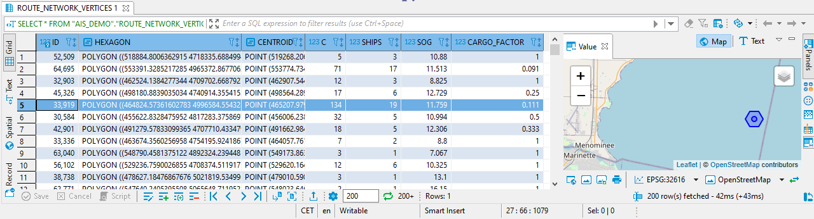

# Exercise 5 - Vessel Routes

In this exercise, we make use of the HANA Graph engine to find suitable routes for cargo ships. The graph engine operates on networks, represented by vertices and edges. Since there is no "street network" on lake Michigan, we will use the AIS data to generate a network - think of it as a set of edges on which ships usually travel. We then will find a least-cost path from Menominee to Chicago for a cargo ship. At last, we will simulate a blockage - we will "disrupt" the network and calculate an alternative route.

## Generate a Network for Path Finding<a name="subex1"></a>

Our Network/Graph is made of vertices and edges. First we create the vertices. For this, we basically just take the results of a spatial clustering query.

```SQL
-- Let's make a network/graph on which we can calculate routes.
-- We'll take hexagon clusters as vertices and then calculate edges between.
DROP TABLE "AIS_DEMO"."ROUTE_NETWORK_VERTICES";
CREATE COLUMN TABLE "AIS_DEMO"."ROUTE_NETWORK_VERTICES" (
	"ID" BIGINT PRIMARY KEY,
	"HEXAGON" ST_GEOMETRY(32616),
	"CENTROID" ST_GEOMETRY(32616),
	"C" BIGINT,
	"SHIPS" INT,
	"SOG" DOUBLE,
	"CARGO_FACTOR" DOUBLE DEFAULT 1.0
);

SELECT ST_CLUSTERID() AS "ID", ST_CLUSTERCELL() AS "HEXAGON", ST_CLUSTERCELL().ST_CENTROID() AS "CENTROID",
		COUNT(*) AS C, COUNT(DISTINCT "MMSI") AS "SHIPS", AVG("SOG") AS "SOG"
	FROM "AIS_DEMO"."AIS_2017"
	GROUP CLUSTER BY "SHAPE_32616" USING HEXAGON Y CELLS 400
	INTO "AIS_DEMO"."ROUTE_NETWORK_VERTICES" ("ID", "HEXAGON", "CENTROID", "C", "SHIPS", "SOG");
```

We want to find routes for cargo ships especially. So, if the cluster cell is on a frequent cargo route, we set a "CARGO_FACTOR". For this, we are re-using the results from the cargo ship clustering we ran in the previous exercise. The higher the number of cargo ships observed in a cluster cell, the lower the cargo fact will be: 1/number of ships. The "CARGO_FACTOR" will then be used in a cost function to calculate a least-cost path... i.e. a path that *favors* established cargo routes.

So, let's update the network vertices "CARGO_FACTOR" column.

```SQL

MERGE INTO "AIS_DEMO"."ROUTE_NETWORK_VERTICES" R
	USING (SELECT R."ID", 1/MAX(C."SHIPS") AS "CARGO_FACTOR" FROM "AIS_DEMO"."ROUTE_NETWORK_VERTICES" AS R
		INNER JOIN "AIS_DEMO"."CLUSTER_CARGO" AS C
		ON R."CENTROID".ST_INTERSECTS(C."SHAPE_32616") = 1
		GROUP BY R."ID") AS C
	ON R."ID" = C."ID"
	WHEN MATCHED THEN UPDATE SET R."CARGO_FACTOR" = C."CARGO_FACTOR";

SELECT * FROM "AIS_DEMO"."ROUTE_NETWORK_VERTICES";

SELECT MIN(CARGO_FACTOR), MAX(CARGO_FACTOR)
  FROM "AIS_DEMO"."ROUTE_NETWORK_VERTICES";
```
The network vertices table now contains the following data: for each vertex is represented by a hexagon and centroid, along with the number of observations, and the number of distinct ships. The highlighted cell below is an area where cargo ships usually travel... the "CARGO_FACTOR" is 0.111. When calculating routes, this cell will "cost" only 0.111 to traverse, whereas other cells are more costly, thus unlikely to be part of a cargo route.



Next, we need to create the edges between the vertices, so we have a network on which we can route. As of today, this is a little tricky (but things will improve in the future). We will use a generic parameterized view to generate edges for a give grid size.

```SQL
-- We can  construct the edges between the cluster cells. The query below identifies the neighbors of each cluster cell.
CREATE OR REPLACE VIEW "AIS_DEMO"."V_HEX_CLUSTER_NEIGHBORS" (IN i_x INT, IN i_y INT) AS
WITH C AS (
	SELECT ELEMENT_NUMBER FROM SERIES_GENERATE_INTEGER(1, 1, :i_x+1)
	)
	SELECT * FROM (
		SELECT TWO_ROWS."SOURCE"+ALL_ROWS."OFFSET"*:i_x AS "SOURCE", TWO_ROWS."TARGET"+ALL_ROWS."OFFSET"*:i_x AS "TARGET", TWO_ROWS."NEI", TWO_ROWS."ROW_NO"+ALL_ROWS."OFFSET" AS "ROW_NO" FROM (
			SELECT "SOURCE", "TARGET", "NEI", 1 AS "ROW_NO" FROM (
				SELECT ELEMENT_NUMBER AS "SOURCE", ELEMENT_NUMBER-1 AS "TARGET", 'left' AS "NEI" FROM C WHERE ELEMENT_NUMBER > 1
				UNION
				SELECT ELEMENT_NUMBER AS "SOURCE", ELEMENT_NUMBER+1 AS "TARGET", 'right' AS "NEI" FROM C WHERE ELEMENT_NUMBER < :i_x
				UNION
				SELECT ELEMENT_NUMBER AS "SOURCE", ELEMENT_NUMBER+:i_x-1 AS "TARGET", 'left upper' AS "NEI" FROM C WHERE ELEMENT_NUMBER > 1
				UNION
				SELECT ELEMENT_NUMBER AS "SOURCE", ELEMENT_NUMBER+:i_x AS "TARGET", 'right upper' AS "NEI" FROM C
				UNION
				SELECT ELEMENT_NUMBER AS "SOURCE", ELEMENT_NUMBER-:i_x-1 AS "TARGET", 'left lower' AS "NEI" FROM C WHERE ELEMENT_NUMBER > 1
				UNION
				SELECT ELEMENT_NUMBER AS "SOURCE", ELEMENT_NUMBER-:i_x AS "TARGET", 'right lower' AS "NEI" FROM C
			) AS UNEVEN_ROW -- start with 1
			UNION
			SELECT "SOURCE", "TARGET", "NEI", 2 AS "ROW_NO" FROM (
				SELECT ELEMENT_NUMBER+:i_x AS "SOURCE", ELEMENT_NUMBER+:i_x-1 AS "TARGET", 'left' AS "NEI" FROM C WHERE ELEMENT_NUMBER > 1
				UNION
				SELECT ELEMENT_NUMBER+:i_x AS "SOURCE", ELEMENT_NUMBER+:i_x+1 AS "TARGET", 'right' AS "NEI" FROM C WHERE ELEMENT_NUMBER < :i_x
				UNION
				SELECT ELEMENT_NUMBER+:i_x AS "SOURCE", ELEMENT_NUMBER+:i_x+:i_x AS "TARGET", 'left upper' AS "NEI" FROM C
				UNION
				SELECT ELEMENT_NUMBER+:i_x AS "SOURCE", ELEMENT_NUMBER+:i_x+:i_x+1 AS "TARGET", 'right upper' AS "NEI" FROM C WHERE ELEMENT_NUMBER < :i_x
				UNION
				SELECT ELEMENT_NUMBER+:i_x AS "SOURCE", ELEMENT_NUMBER+:i_x-:i_x AS "TARGET", 'left lower' AS "NEI" FROM C
				UNION
				SELECT ELEMENT_NUMBER+:i_x AS "SOURCE", ELEMENT_NUMBER+:i_x-:i_x+1 AS "TARGET", 'right lower' AS "NEI" FROM C WHERE ELEMENT_NUMBER < :i_x
			) AS EVEN_ROW -- start with 1
		) AS TWO_ROWS
		LEFT JOIN 	
		(SELECT "GENERATED_PERIOD_START" AS "OFFSET" FROM SERIES_GENERATE_INTEGER(2, 0, :i_y+1)) AS "ALL_ROWS" ON 1=1
	)
	WHERE "TARGET" > 0 AND "TARGET" <= :i_x*:i_y AND "SOURCE" <= :i_x*:i_y
;
```

With this view, we can generate the edges connecting two adjacent hexagons and store them in the table "ROUTE_NETWORK_EDGES". The edges have attributes which we will use for path finding later, e.g. the "AVG_CARGO_FACTOR", which is the average of the cargo factors assigned to the source and target vertex.

````SQL
-- Create the edges table
DROP TABLE "AIS_DEMO"."ROUTE_NETWORK_EDGES";
CREATE COLUMN TABLE "AIS_DEMO"."ROUTE_NETWORK_EDGES" (
	"ID" BIGINT PRIMARY KEY GENERATED ALWAYS AS IDENTITY,
	"SOURCE" BIGINT NOT NULL,
	"TARGET" BIGINT NOT NULL,
	"LINE_32616" ST_GEOMETRY(32616),
	"LENGTH" DOUBLE,
	"AVG_C" DOUBLE,
	"AVG_SHIPS" DOUBLE,
	"AVG_SOG" DOUBLE,
	"AVG_CARGO_FACTOR" DOUBLE DEFAULT 1.0,
	"BLOCKED" BOOLEAN DEFAULT FALSE
);
-- and fill edges table
SELECT "SOURCE", "TARGET", ST_MAKELINE(C1."SHAPE_32616".ST_CENTROID(), C2."SHAPE_32616".ST_CENTROID()) AS "LINE_32616",
		ST_MAKELINE(C1."SHAPE_32616".ST_CENTROID(), C2."SHAPE_32616".ST_CENTROID()).ST_LENGTH() AS "LENGTH",
		(C1."C" + C2."C")/2 AS "AVG_C",
		(C1."SHIPS" + C2."SHIPS")/2 AS "AVG_SHIPS",
		(C1."SOG" + C2."SOG")/2 AS "AVG_SOG",
		(C1."CARGO_FACTOR" + C2."CARGO_FACTOR")/2 AS "AVG_CARGO_FACTOR"
	FROM "AIS_DEMO"."V_HEX_CLUSTER_NEIGHBORS"(400, 388) AS E -- take result from query above as size of the grid
	INNER JOIN "AIS_DEMO"."ROUTE_NETWORK_VERTICES" AS C1 ON E."SOURCE" = C1."ID"
	INNER JOIN "AIS_DEMO"."ROUTE_NETWORK_VERTICES" AS C2 ON E."TARGET" = C2."ID"
	INTO "AIS_DEMO"."ROUTE_NETWORK_EDGES"("SOURCE", "TARGET", "LINE_32616", "LENGTH", "AVG_C", "AVG_SHIPS", "AVG_SOG", "AVG_CARGO_FACTOR");
SELECT MIN("AVG_CARGO_FACTOR"),MAX("AVG_CARGO_FACTOR") FROM "AIS_DEMO"."ROUTE_NETWORK_EDGES";
````

Below we see the network's edges - red color indicates segments which are frequently travelled by cargo ships.


The last thing we need to do is to create a so-called graph workspace. You can think of it as a kind of view which tells the HANA graph engine where the data is - we just point to the two tables we created above: "ROUTE_NETWORK_EDGES" and "ROUTE_NETWORK_VERTICES".

````SQL
-- Create a graph workspace
CREATE GRAPH WORKSPACE "AIS_DEMO"."ROUTE_NETWORK_GRAPH"
    EDGE TABLE "AIS_DEMO"."ROUTE_NETWORK_EDGES" SOURCE COLUMN "SOURCE" TARGET COLUMN "TARGET" KEY COLUMN "ID"
    VERTEX TABLE "AIS_DEMO"."ROUTE_NETWORK_VERTICES" KEY COLUMN "ID";
````

## Use Shortest Path with a Custom Cost Function<a name="subex2"></a>

Having defined a graph workspace, we can leverage the *GraphScript* programming language to create database procedures and functions. The function below takes a START and END vertex, and calculates a least-cost path based on a custom cost function. The cost function takes the length and the "CARGO_FACTOR" into account. Essentially, it tries to balance between a shortest path (in terms of spatial distance) and a suitable path (in terms of where cargo ships usually go). Note that the path algorithm stops when edges are "BLOCKED". Currently, no edges are blocked, but we will later update the graph and simulate a blockage.

````SQL
-- SP function
CREATE OR REPLACE FUNCTION "AIS_DEMO"."F_SHORTEST_PATH"(
	IN i_startVertex BIGINT, IN i_endVertex BIGINT, IN i_cargoFactorWeight DOUBLE
	)
	RETURNS TABLE ("ID" BIGINT, "VERTEX_ORDER" BIGINT)
LANGUAGE GRAPH AS
BEGIN
	GRAPH g = Graph("AIS_DEMO", "ROUTE_NETWORK_GRAPH");
	VERTEX v_start = Vertex(:g, :i_startVertex);
	VERTEX v_end = Vertex(:g, :i_endVertex);
	WeightedPath<DOUBLE> p = Shortest_Path(:g, :v_start, :v_end, (Edge e) => DOUBLE{
		IF (:e."BLOCKED" == FALSE) {RETURN :e."LENGTH"*(:i_cargoFactorWeight + (1.0-:i_cargoFactorWeight)*:e."AVG_CARGO_FACTOR");}
		ELSE {END TRAVERSE;} }, 'ANY');
	RETURN SELECT :v."ID", :VERTEX_ORDER FOREACH v IN Vertices(:p) WITH ORDINALITY AS VERTEX_ORDER;
END;
SELECT * FROM "AIS_DEMO"."F_SHORTEST_PATH"(29117, 28448, 0.8) AS P LEFT JOIN "AIS_DEMO"."ROUTE_NETWORK_VERTICES" AS V ON P.ID = V.ID;
````

The calculated route from Menominee to Chicago is depicted below. Note that the route takes the canal at Sturgeon Bay (zoomed window).


## Simulate a Canal Blockage and Find Alternative Routes<a name="subex3"></a>

We will now simulate a blockage at Sturgeon Bay - maybe the bridge needs maintenance or a ship is stuck. To do so, we update the "ROUTE_NETWORK_EDGES" table and set "BLOCKED" = TRUE for all edges near Sturgeon Bay.

````SQL
UPDATE "AIS_DEMO"."ROUTE_NETWORK_EDGES"
	SET "BLOCKED" = TRUE
	WHERE LINE_32616.ST_INTERSECTS(ST_GEOMFROMTEXT('POINT(-87.38079071044923 44.8311608680887)', 4326).ST_TRANSFORM(32616).ST_BUFFER(200)) = 1;
````
 By changing the underlying edges, our shortest path function now returns a different result, i.e. an alternative route that avoids the blockage by going up north first.

 

## Summary

We have used spatial clustering to create a network/graph on which we can calculate routes on lake Michigan. The actual pathfinding was implemented in GraphScript using a custom cost function. At the end, we simulated a blockage by changing the graph's data. Re-calculating the path reveals an alternative route to Chicago.

Continue to - [Exercise 6 - Spatio-Temporal Clustering ](../ex6/README.md)
