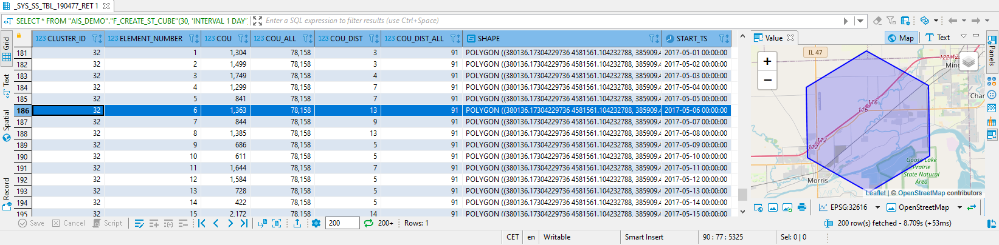

# Exercise 6 - Spatio-Temporal Clustering

In this exercise, we will extend the Spatial Clustering technique introduced in Exercise 4 by the time dimension. So, our AIS observations will by clustered along a spatial grid (X and Y dimension) and along temporal intervals (Z dimension). So we first generate a spatial grid and then add time slices to it. The resulting 3 dimensional data stucture contains "buckets" of data for each combination of grid cell and time interval. Adding a time dimension allows us to detect seasonality within the timeseries for each grid cell, and to predict future traffic from historic observations.

### Clustering per Timeslice

First, we create a function that runs spatial clustering for a single timeslice. The AIS observation data is filtered by the time interval ("I_START_TS" and "I_END_TS") and the resulting dataset is spatially clustered using a fixed grid definition (X/Y MIN/MAX). Later, we will call this function for multiple timeslices in parallel.

````SQL
-- Let's create a view on our data table. This is optional, but it facilitates re-use of the code.
CREATE OR REPLACE VIEW "AIS_DEMO"."V_FILTERED_AIS_2017" AS (
	SELECT "ID", "MMSI", "TS", "SHAPE_32616" AS "LOC", 1 AS COU FROM "AIS_DEMO"."AIS_2017"
);

-- Function to calculate hex clusters for a given time slice.
-- The input is a spatial extent (MIN/MAX X/Y) and a temporal extent (START/END timestamp).
-- It returns the result of a spatial clustering process for a single timeslice.
CREATE OR REPLACE FUNCTION "AIS_DEMO"."F_CALC_HEX_CLUSTER_FOR_TIMESLICE"(
    IN I_X INT,
	IN I_X_MIN DOUBLE, IN I_X_MAX DOUBLE,
	IN I_Y_MIN DOUBLE, IN I_Y_MAX DOUBLE,
	IN I_START_TS TIMESTAMP, IN I_END_TS TIMESTAMP, IN I_ELEMENT_NUMBER INT
    )
    RETURNS TABLE ("CLUSTER_ID" INT, "COU" INT, "COU_DIST" INT, "ELEMENT_NUMBER" INT)
LANGUAGE SQLSCRIPT READS SQL DATA AS
BEGIN
	RES = SELECT ST_CLUSTERID() AS "CLUSTER_ID", COUNT(*) AS "COU", COUNT(DISTINCT "MMSI") AS "COU_DIST", :I_ELEMENT_NUMBER AS "ELEMENT_NUMBER"
		FROM "AIS_DEMO"."V_FILTERED_AIS_2017"
		WHERE "TS" >= :I_START_TS AND "TS" < :I_END_TS
		GROUP CLUSTER BY "LOC" USING HEXAGON
		X BETWEEN :I_X_MIN AND :I_X_MAX CELLS :I_X
		Y BETWEEN :I_Y_MIN AND :I_Y_MAX;
    RETURN :RES;
END;
````

### Orchestration

Next, we create a function that orchestrates a number of steps.
<ol><li>calculate the spatial extent of our data</li>
<li>generate hexagon grid</li>
<li>generate timeslice intervals</li>
<li>run spatial clustering for each timeslice and merge results</li>
<li>create the final result, NULL handling, joining additional data</li>
</ol>


````SQL
-- This is an orchestration function - it calls the time-bounded functiona bove for each timeslice in the data.
-- Input is a basic grid definition: the number of cells in X direction
-- and a valid timeseries interval: see https://help.sap.com/viewer/c1d3f60099654ecfb3fe36ac93c121bb/latest/en-US/c8101037ad4344768db31e68e4d30eb4.html
CREATE OR REPLACE FUNCTION "AIS_DEMO"."F_CREATE_ST_CUBE"(
		IN I_X INT, -- number OF cells IN X direction
		IN I_INTERVAL VARCHAR(100) -- a valid timeseries expression, e.g. 'INTERVAL 1 DAY'
 	)
    RETURNS TABLE (
    	"CLUSTER_ID" INT, "ELEMENT_NUMBER" INT, "COU" INT, "COU_ALL" INT, "COU_DIST" INT, "COU_DIST_ALL" INT,
    	"SHAPE" ST_GEOMETRY(32616), "START_TS" TIMESTAMP
   	)
LANGUAGE SQLSCRIPT READS SQL DATA AS
BEGIN
	DECLARE V_XMIN DOUBLE;
	DECLARE V_XMAX DOUBLE;
	DECLARE V_YMIN DOUBLE;
	DECLARE V_YMAX DOUBLE;
	DECLARE V_START_TS TIMESTAMP;
	DECLARE V_END_TS TIMESTAMP;
	DECLARE V_SRID INT = 32616;

	-- calculate the spatial extent (all data) and store the result in variables
	SELECT MIN("LOC".ST_X()), MAX("LOC".ST_X()), MIN("LOC".ST_Y()), MAX("LOC".ST_Y())
		INTO V_XMIN, V_XMAX, V_YMIN, V_YMAX
		FROM "AIS_DEMO"."V_FILTERED_AIS_2017";

	-- Calculate the hexagon cluster grid (all data)
	grid = SELECT ST_CLUSTERID() AS "CLUSTER_ID", ST_CLUSTERCELL() AS "SHAPE", COUNT(*) AS "COU_ALL", COUNT(DISTINCT "MMSI") AS "COU_DIST_ALL"
		FROM "AIS_DEMO"."V_FILTERED_AIS_2017"
		GROUP CLUSTER BY "LOC" USING HEXAGON X BETWEEN :V_XMIN AND :V_XMAX CELLS :I_X Y BETWEEN :V_YMIN AND :V_YMAX;

	-- Calculate the timeslice intervals according to provided interval definition, e.g. 1 DAY
	-- First get the minimun and maximum timestamp, i.e. the timespan of the data
	SELECT MIN("TS"), MAX("TS")	INTO V_START_TS, V_END_TS FROM "AIS_DEMO"."V_FILTERED_AIS_2017";
	-- then generate a timeseries
	time_slices = SELECT T."GENERATED_PERIOD_START", T."GENERATED_PERIOD_END", TO_INT(T."ELEMENT_NUMBER") AS "ELEMENT_NUMBER"
		FROM SERIES_GENERATE_TIMESTAMP(:I_INTERVAL, :V_START_TS, :V_END_TS) AS T;

	-- Call the clustering function for each individual time slice
	-- The MAP_MERGE operator calls the functions in parallel and merges the results into a single table: grid_temporal
	grid_temporal = MAP_MERGE(:time_slices, "AIS_DEMO"."F_CALC_HEX_CLUSTER_FOR_TIMESLICE"(:I_X, :V_XMIN, :V_XMAX, :V_YMIN, :V_YMAX,
		:time_slices."GENERATED_PERIOD_START", :time_slices."GENERATED_PERIOD_END", :time_slices."ELEMENT_NUMBER"));

	-- A little bit of NULL handling
    RETURN SELECT grid."CLUSTER_ID", time_slices."ELEMENT_NUMBER", COALESCE(grid_temporal."COU", 0) AS "COU", grid."COU_ALL",
    			COALESCE(grid_temporal."COU_DIST", 0) AS "COU_DIST", grid."COU_DIST_ALL", grid."SHAPE", time_slices."GENERATED_PERIOD_START" AS "START_TS"
    	FROM :grid AS grid
    	FULL OUTER JOIN :time_slices AS time_slices ON 1=1
    	LEFT JOIN :grid_temporal AS grid_temporal ON grid_temporal."CLUSTER_ID" = grid."CLUSTER_ID" AND grid_temporal."ELEMENT_NUMBER" = time_slices."ELEMENT_NUMBER";
END;

-- Call the function - hte first parameter is the number of grid cells in X direction, the second is a time interval definition
SELECT * FROM "AIS_DEMO"."F_CREATE_ST_CUBE"(30, 'INTERVAL 1 DAY') ORDER BY "CLUSTER_ID", "ELEMENT_NUMBER";
````

The data returned by the ST_CUBE function is displayed below. Cluster cell 32 represents the area covered by the hexagon. This cluster cell contains a number of elements which are the timeslices. The highlighted row below indicates that "ELEMENT_NUMBER" = 7 corresponds to the time interval starting at 2017-05-07 00:00:00. On this day, in this area, we saw 844 AIS signals from 9 vessels. In total, there were 78158 signals from 91 vessels in this area.



## Summary

We have explained two SQLScript functions that allow us to run spatio-temporal clustering. We used an orchestration process to merge the results from spatial clustering for multiple timesplices.

Continue to - [Exercise 7 - Predict Traffic ](../ex7/README.md)
