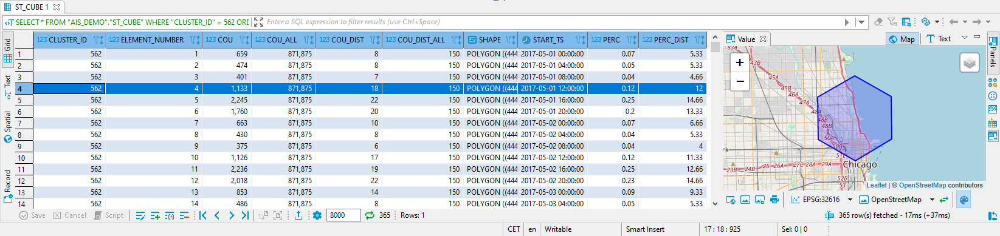
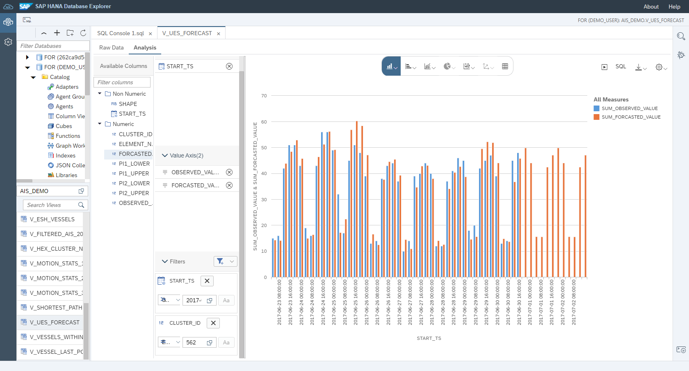

# Exercise 7 - Predict Traffic

In this exercise, we will leverage the data create by spatio-temporal clustering to forecast the traffic for each individual cluster cell. For each cluster cell we have historic traffic observations binned into 4h intervals. We will use PAL (Massive) Auto Exponential Smoothing, which runs Exponential Smoothing for each cluster cell and chooses the most accurate Exponential Smoothing variant automatically. The result yields a traffic prediction for 12 4h intervals.

## Create Space-Time Cube<a name="subex1"></a>

First, we will store the data from spatio-temporal clustering into a table "ST_CUBE".

````SQL
CREATE COLUMN TABLE "AIS_DEMO"."ST_CUBE" AS (
	SELECT *, TO_DECIMAL(("COU"/"COU_ALL")*100, 5,2) AS "PERC", TO_DECIMAL(("COU_DIST"/"COU_DIST_ALL")*100, 5,2) AS "PERC_DIST"
	FROM "AIS_DEMO"."F_CREATE_ST_CUBE"(50, 'INTERVAL 4 HOUR')
);
-- Our ST_CUBE table contains 570k records, representing 1568 cluster cells and 365 elements, i.e. 4h interval timeslices
-- Let's take a look at the data for cluster 562, which is near the Chicago port
SELECT * FROM "AIS_DEMO"."ST_CUBE" WHERE "CLUSTER_ID" = 562 ORDER BY "ELEMENT_NUMBER";
````

The generated data for cluster cell 562 looks like below: during the interval [2017-05-01 12:00:00, 2017-05-01 16:00:00[ we observed 1133 AIS signals, which is 0.12% of the cells total of 871875, and 18 distinct vessel, which is 12% of the cells total of 150.



## Timeseries Forecasting using Massive Auto Exponential Smoothing<a name="subex2"></a>

Now, based on the historic timeseries of vessel observations for each cluster cell, we run a timeseries forecast algorithm called "Auto Exponential Smoothing", which is exposed via the new "Unified Exponential Smoothing" (UES) interface of the Predictive Analysis Library (PAL). See [PAL UES documentation](https://help.sap.com/viewer/319d36de4fd64ac3afbf91b1fb3ce8de/2021_3_QRC/en-US/0d3683ebfa3a445ea9df601f712b8fd7.html).
We use a view to expose our ST_CUBE data to PAL and create a table for the results of the algorithm.

````SQL
CREATE OR REPLACE VIEW "AIS_DEMO"."UES_DATA" AS (
	SELECT "CLUSTER_ID", "ELEMENT_NUMBER", "COU_DIST" AS "OBSERVED_VALUE", "SHAPE", "START_TS" FROM "AIS_DEMO"."ST_CUBE"
);
-- We need a table to store the results of our forecast: UES_FORECAST
CREATE COLUMN TABLE "AIS_DEMO"."UES_FORECAST" (
	"CLUSTER_ID" INT, "ELEMENT_NUMBER" INT, "FORCASTED_VALUE" DOUBLE, "PI1_LOWER" DOUBLE, "PI1_UPPER" DOUBLE, "PI2_LOWER" DOUBLE, "PI2_UPPER" DOUBLE
);
````

Next, we execute the actual algorithm. The following code block generates the parameters required by Unified Exponential Smoothing, calls the algorithms, and stores the result in the "UES_FORECATS" table.

````SQL
DO BEGIN
	-- declare parameters
	DECLARE lt_param0 TABLE("PARAM_NAME" VARCHAR (100), "INT_VALUE" INTEGER, "DOUBLE_VALUE" DOUBLE, "STRING_VALUE" VARCHAR (100));
	:lt_param0.INSERT(( 'FUNCTION', NULL, NULL,'MAESM'), 1);
    :lt_param0.INSERT(( 'THREAD_RATIO', NULL, 1.0, NULL), 2);
    :lt_param0.INSERT(( 'FORECAST_NUM', 12, NULL, NULL), 3);
    :lt_param0.INSERT(( 'MODELSELECTION', 1, NULL, NULL), 4);
    :lt_param0.INSERT(( 'MAX_ITERATION', 500, NULL, NULL), 5);
    :lt_param0.INSERT(( 'MEASURE_NAME', NULL, NULL,'MAPE'), 6);
	-- set params and data
	lt_param = SELECT DAT."GROUP_ID", P.* FROM :lt_param0 AS P CROSS JOIN (SELECT DISTINCT "CLUSTER_ID" AS "GROUP_ID" FROM "AIS_DEMO"."UES_DATA") AS DAT;
	lt_data = SELECT "CLUSTER_ID", "ELEMENT_NUMBER", "OBSERVED_VALUE" FROM "AIS_DEMO"."UES_DATA";
	-- call UES
	CALL _SYS_AFL.PAL_UNIFIED_EXPONENTIALSMOOTHING(:lt_data, :lt_param, t_forecast, t_stats, f_errmsge, pl1, pl2);
	-- store results
	INSERT INTO "AIS_DEMO"."UES_FORECAST" ("CLUSTER_ID", "ELEMENT_NUMBER", "FORCASTED_VALUE", "PI1_LOWER", "PI1_UPPER", "PI2_LOWER", "PI2_UPPER")
		SELECT "GROUP_ID" AS "CLUSTER_ID", "TIMESTAMP" AS "ELEMENT_NUMBER", "VALUE", "PI1_LOWER", "PI1_UPPER", "PI2_LOWER", "PI2_UPPER"
		FROM :t_forecast;
	-- get the stats
	SELECT "GROUP_ID", "STAT_NAME", "STAT_VALUE" FROM :t_stats WHERE "STAT_NAME" IN ('FORECAST_MODEL_NAME', 'MSE');
END;
````

The "FUNCTION" parameter of UES is set to "MAESM", which is Massive Auto Exponential Smoothing. It automatically chooses the best exponential smoothing variant (single, double, triple) for each timeseries. Setting "FORECAST_NUM" to 12 indicates that we require 12 intervals to be forecasted.

To view the historic data along the forecast, we join the historic data to the "UES_FORECAST" table.

````SQL
-- Joining the historic data and forecast to view them side-by-side
CREATE OR REPLACE VIEW "AIS_DEMO"."V_UES_FORECAST" AS (
	SELECT FORC."CLUSTER_ID", FORC."ELEMENT_NUMBER", FORC."FORCASTED_VALUE", FORC."PI1_LOWER", FORC."PI1_UPPER", FORC."PI2_LOWER", FORC."PI2_UPPER",
		DAT."OBSERVED_VALUE", DAT."SHAPE",
		TO_SECONDDATE (TSERIES."GENERATED_PERIOD_START") AS "START_TS"
	FROM "AIS_DEMO"."UES_FORECAST" AS FORC
	LEFT JOIN "AIS_DEMO"."UES_DATA" AS DAT ON FORC."ELEMENT_NUMBER" = DAT."ELEMENT_NUMBER" AND FORC."CLUSTER_ID" = DAT."CLUSTER_ID"
	LEFT JOIN (SELECT T."GENERATED_PERIOD_START", T."GENERATED_PERIOD_END", T."ELEMENT_NUMBER"
		FROM SERIES_GENERATE_TIMESTAMP('INTERVAL 4 HOUR', '2017-05-01 00:00:00', '2017-07-07 24:00:00') AS T) AS TSERIES
		ON FORC."ELEMENT_NUMBER" = TSERIES."ELEMENT_NUMBER"
);
````

We can the use SAP HANA Database Explorer to analyze the data exposed by the view. We see the observed traffic (blue) and the forecast (orange) for the cluster cell 562 (Chicago) and 4h intervals.



## Summary

We have used a Space-Time Cube data structure to run timeseries forecast of traffic data. We visualized the forecast using the native charting options of SAP HANA Database Explorer.

Continue to - [Exercise 8 - Enterprise Search](../ex8/README.md)
