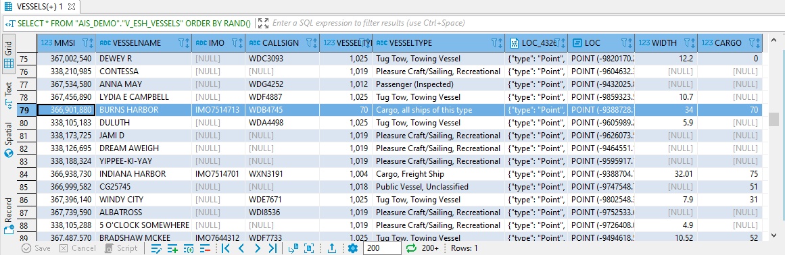
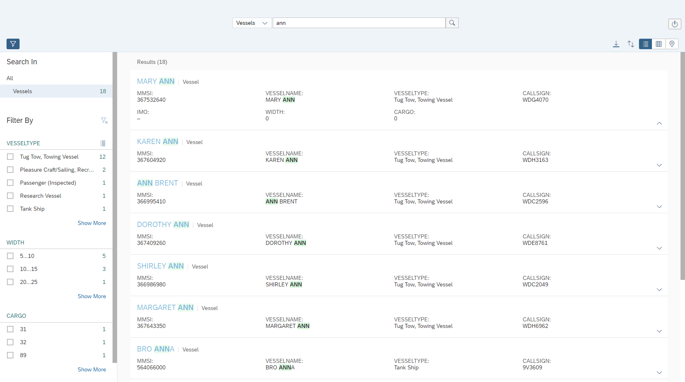
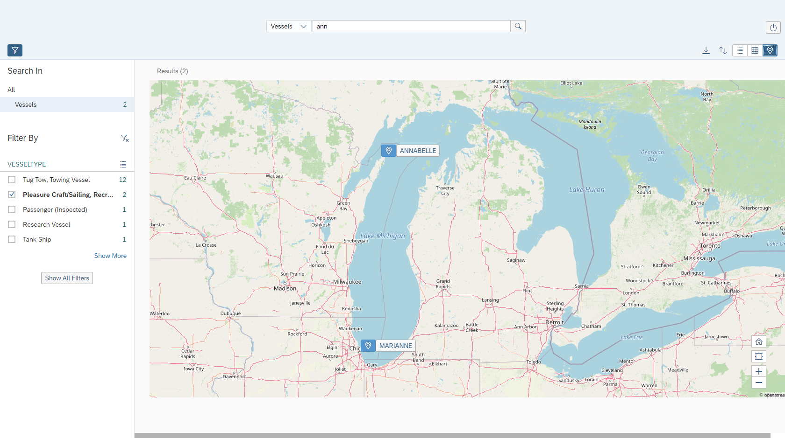

# Exercise 8 - Enterprise Search

In this exercise, we will quickly introduce "Enterprise Search" (ESH) which is an integral part of SAP HANA. We will first create a search model, run a couple of search queries, and finally see a search UI in action. For more details see the [SAP HANA Cloud Search Developer Guide](https://help.sap.com/viewer/05c9edaee7fe4d28ab3627d0b1583df6/latest/en-US) and the [Enterprise Search Development Kit](https://github.wdf.sap.corp/pages/EnterpriseSearch/getting-started/).

## Create a Search Model<a name="subex1"></a>

First, we will generate/collect some vessel data we want to search on. We collect the vessel's name and other textual attributes along with the vessel's last position.

````SQL
-- We first create a view that identifies each vessel's last position
CREATE OR REPLACE VIEW "AIS_DEMO"."V_VESSEL_LAST_POSITION" AS (
	SELECT "MMSI", "SHAPE_32616".ST_TRANSFORM(4326) AS "LOC_4326", "SHAPE_32616".ST_TRANSFORM(3857) AS "LOC_3857" FROM (
	SELECT "MMSI", "SHAPE_32616", RANK() OVER(PARTITION BY "MMSI" ORDER BY "TS" DESC) AS R FROM "AIS_DEMO"."AIS_2017"
	) WHERE R = 1
);

-- ... and store the results in a table
CREATE COLUMN TABLE "AIS_DEMO"."VESSELS" (
	"MMSI" INT,
	"VESSELNAME" NVARCHAR(100),
	"IMO" NVARCHAR(500),
	"CALLSIGN" NVARCHAR(500),
	"VESSELTYPE_CODE" INT,
	"VESSELTYPE" NVARCHAR(100),
	"LOC_4326" ST_POINT(4326),
	"LOC_3857" ST_POINT(3857),
	"WIDTH" DOUBLE,
	"CARGO" DOUBLE
);
SELECT DAT."MMSI", "VESSELNAME", "IMO", "CALLSIGN", DAT."VESSELTYPE" AS "VESSELTYPE_CODE", CODES."TEXT" AS "VESSELTYPE",
		POS."LOC_4326", POS."LOC_3857", "WIDTH", MAX("CARGO") AS "CARGO"
	FROM "AIS_DEMO"."AIS_2017" AS DAT
	LEFT JOIN "AIS_DEMO"."VESSELTYPE_TEXT" AS CODES ON DAT."VESSELTYPE" = CODES."CODE"
	LEFT JOIN "AIS_DEMO"."V_VESSEL_LAST_POSITION" AS POS ON DAT."MMSI" = POS."MMSI"
	WHERE "VESSELNAME" IS NOT NULL
	GROUP BY DAT."MMSI", "VESSELNAME", "IMO", "CALLSIGN", DAT."VESSELTYPE", CODES."TEXT", POS."LOC_4326", POS."LOC_3857", "WIDTH"
INTO "AIS_DEMO"."VESSELS";

-- ... and put a nice view on top that exposes the data we want to search and display in a result
CREATE OR REPLACE VIEW "AIS_DEMO"."V_ESH_VESSELS" AS (
	SELECT "MMSI", "VESSELNAME", "IMO", "CALLSIGN", "VESSELTYPE_CODE", "VESSELTYPE",
		"LOC_4326".ST_ASGEOJSON() AS "LOC_4326", "LOC_3857" AS "LOC", "WIDTH", "CARGO"
		FROM AIS_DEMO.VESSELS
);

SELECT * FROM "AIS_DEMO"."V_ESH_VESSELS";
````

The data exposed by `V_ESH_VESSELS` looks like this.



Next, we define a search model on this data structure. A search model tells the search engine which columns to search in, and how results are displayed in the search UI. One way to define a search model is via the built-in procedure `ESH_CONFIG`.

````SQL
CALL ESH_CONFIG('
[{"uri":    "~/$metadata/EntitySets", "method": "PUT",
"content":{
"Fullname": "AIS/V_ESH_VESSELS",
"EntityType": {
	"@Search.searchable": true,
	"@EnterpriseSearch.enabled": true,
	"@SAP.Common.Label": "Vessels",
	"@UI.headerInfo.title": {"value": "VESSELNAME"},
	"@UI.headerInfo.typeName": "Vessel",
	"@UI.headerInfo.typeNamePlural": "Vessels",
	"@EnterpriseSearchHana.passThroughAllAnnotations":true,
	"@EnterpriseSearchHana.processing.ignoreInvalidSearchOptions": true,
"Properties": [
{
	"Name": "MMSI",
	"@UI.identification": { "position": 1 },
	"@EnterpriseSearch.key": true,
	"@Search.defaultSearchElement": true
},{
    "Name": "VESSELNAME",
	"@UI.identification": { "position": 2 },
    "@EnterpriseSearch.highlighted.enabled": true,
    "@Search.defaultSearchElement": true,
    "@EnterpriseSearch.defaultValueSuggestElement": true,
    "@Search.fuzzinessThreshold": 0.8,
    "@EnterpriseSearch.searchOptions": "similarCalculationMode=substringsearch"
},{
	"Name": "VESSELTYPE",
	"@UI.identification": { "position": 3 },
	"@EnterpriseSearch.highlighted.enabled": true,
	"@Search.defaultSearchElement": true,
	"@EnterpriseSearch.filteringFacet.default": true,
	"@EnterpriseSearch.filteringFacet.displayPosition": 1,
	"@Search.fuzzinessThreshold": 0.8,
	"@EnterpriseSearch.searchOptions": "similarCalculationMode=substringsearch"
},{
	"Name": "CALLSIGN",
	"@UI.identification": { "position": 4 },
	"@EnterpriseSearch.highlighted.enabled": true,
	"@Search.defaultSearchElement": true,
	"@Search.fuzzinessThreshold": 0.8
},{
    "Name": "IMO",
	"@UI.identification": { "position": 5 },
    "@EnterpriseSearch.highlighted.enabled": true,
    "@Search.defaultSearchElement": true,
    "@Search.fuzzinessThreshold": 0.8
},{
    "Name": "LOC_4326",
	"@UI.identification": { "position": 10 }
},{
    "Name": "WIDTH",
    "@Search.defaultSearchElement": false,
    "@EnterpriseSearch.filteringFacet.default": true,
    "@EnterpriseSearch.filteringFacet.displayPosition": 2,
    "@UI.identification": { "position": 6 }
},{
	"Name": "CARGO",
	"@Search.defaultSearchElement": false,
	"@EnterpriseSearch.filteringFacet.default": true,
	"@EnterpriseSearch.filteringFacet.displayPosition": 3,
	"@UI.identification": { "position": 7 }
}
]}}}]',?);
````

## Run a Search Query<a name="subex2"></a>

Search queries can be run via the built-in procedure `ESH_SEARCH` and use ODATA syntax.

````SQL
CALL SYS.ESH_SEARCH('[ "/v20411/AIS_DEMO/$all?$filter=Search.search(query=''ann'')" ]', ?);
````

Leveraging the development kit, we can bring up a search UI and interact with the data in a convenient way. We first search for "ann" in our vessel data.



Then we filter for "Pleasure Crafts" and bring the result on a map.



## Summary

We have introduced Enterprise Search. ESH comprises a model, query interface, and a development kit.

Continue to - [Exercise 9 - Document Store and Graph](../ex9/README.md)
