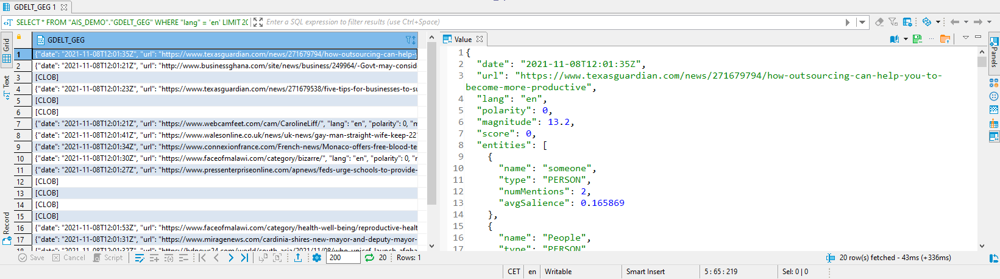
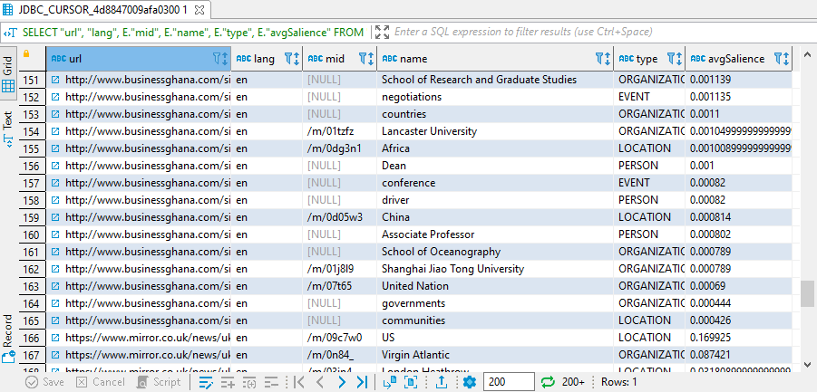
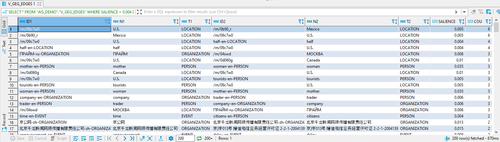
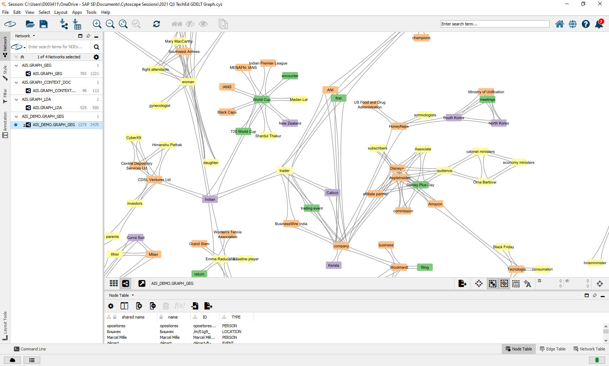

# Exercise 9 - Document Store and Graph

In this exercise, we will work with data from the [GDELT project](https://www.gdeltproject.org/), in specific: the *Global Entity Graph* (GEG). There is a new GEG package every 15 minutes, which contains entities like persons, organization, locations, and events mentioned in global news. Each 15 minute file contains a JSON document for each analyzed news article. We will download a file, dump it into SAP HANA Cloud JSON Document Store, and create an entity co-occurrence graph which we finally visualize using [Cytoscape](https://cytoscape.org/).

## Load JSON data via Python Client for Machine Learning (hana-ml)<a name="subex1"></a>

The JSON data in a GDELT GEG file looks like below. For a news article there is an array of mentioned entities.
````json
{
	"date": "2021-11-08T12:02:54Z",
	"url": "https://www.dnaindia.com/india/report-five-years-of-demonetization-how-it-has-helped-digitalising-india-pm-modi-upi-google-play-online-payments-news-2918794",
	"lang": "en",
	"polarity": 0,
	"magnitude": 4,
	"score": 0,
	"entities": [{
		"name": "Narendra Modi",
		"type": "PERSON",
		"mid": "/m/0296q2",
		"wikipediaUrl": "https://en.wikipedia.org/wiki/Narendra_Modi",
		"numMentions": 2,
		"avgSalience": 0.138123
	}, ...
	]
}
````

We will now import a file covering a 15 minute interval of global news coverage. There are many ways to import or replicate data in SAP HANA Cloud. A nice one is part of the [Python Client API for machine learning algorithms (hana-ml)](https://help.sap.com/doc/1d0ebfe5e8dd44d09606814d83308d4b/2.0.05/en-US/html/index.html). Primarily facilitating the use of PAL algorithms for data scientists, its `docstore` package contains a function `create_collection_from_elements` which writes JSON data into a collection in HANA Document Store. The python code below uses this function.

*If you want to work with the GEG data, but don't want to get into hana-ml, you can also import the file "DAT262_AIS_DEMO_GEG.tar.gz" in the [data_and_script](../data_and_script/) folder via Database Explorer. Note this only works if you have a HANA system with Document Store enabled. Document Store is currently not available in SAP HANA Cloud trial.*

````Python
import gzip
import json
import os
import requests
from io import BytesIO
import hana_ml
from hana_ml.docstore import create_collection_from_elements

respGEG = requests.get('http://data.gdeltproject.org/gdeltv3/geg_gcnlapi/20211108120300.geg-gcnlapi.json.gz')

with gzip.open(BytesIO(respGEG.content), 'rt', encoding='utf-8') as f:
    content = f.read().splitlines()

jlist = []
for doc in content:
    try:
        jdoc = json.loads(doc)
        jlist.append(jdoc)
    except Exception as exception:
        jdoc = json.loads(doc.replace('"wikipediaUrl": ,', '"wikipediaUrl": "dummy",'))
        jlist.append(jdoc)

coll = create_collection_from_elements(
    connection_context = cc,
    schema = schema,
    collection_name = 'GDELT_GEG',
    elements = jlist
    )
````

Once stored in a HANA collection, we can query the data using SQL.

````SQL
SELECT * FROM "AIS_DEMO"."GDELT_GEG" WHERE "lang" = 'en';
````



We are interested in the POLE entities (Person, Organization, Location, Event), so let's use the UNNEST operator to return these entities in a table format.

````SQL
-- UNNEST the entities of each document
SELECT "url", "lang", E."mid", E."name", E."type", E."avgSalience"
	FROM "AIS_DEMO"."GDELT_GEG"
	UNNEST "entities" AS E
	WHERE E."type" IN ('PERSON', 'ORGANIZATION', 'LOCATION', 'EVENT');
````



## Generate a Graph and Visualize in Cytoscape<a name="subex2"></a>

We will now generate a entity co-occurrence graph. Basically, we join each entity to entities mentioned in the same news article. The idea is that if two entities - let's say "China" and "Lancaster University" - are mentioned in the same text, then there is a kind of relationship between these two. We will later visualize these relationships to gain an understanding of "what's in the news?". So let's create a view which identifies these co-occurrences.

````SQL
CREATE OR REPLACE VIEW "AIS_DEMO"."V_GEG_EDGES" AS (
	SELECT "ID1", "N1", "T1", "ID2", "N2", "T2", AVG("SALIENCE") AS "SALIENCE", COUNT(*) AS COU FROM (
		SELECT COALESCE(T1."mid", T1."name"||'-'||T1."lang"||'-'||T1."type") AS "ID1", T1."name" AS "N1", T1."type" AS "T1",
			COALESCE(T2."mid", T2."name"||'-'||T2."lang"||'-'||T2."type") AS "ID2", T2."name" AS "N2", T2."type" AS "T2", (T1."avgSalience"*T2."avgSalience") AS SALIENCE
		FROM "AIS_DEMO"."V_GEG_ENTITIES" AS T1
		LEFT JOIN "AIS_DEMO"."V_GEG_ENTITIES" AS T2 ON T1."url" = T2."url"
		WHERE T1."name" != T2."name"
	)
	GROUP BY "ID1", "N1", "T1", "ID2", "N2", "T2"
);
SELECT * FROM "AIS_DEMO"."V_GEG_EDGES" WHERE SALIENCE > 0.004 ORDER BY COU DESC;
````

We see for example that "U.S." and "Mexico" co-occur in 6 news articles.



Next, we will store the more prominent relations in a table.

````SQL
DROP TABLE "AIS_DEMO"."GDELT_GEG_EDGES";
CREATE COLUMN TABLE "AIS_DEMO"."GDELT_GEG_EDGES" (
	"ID" bigint GENERATED ALWAYS AS IDENTITY PRIMARY KEY,
	"SOURCE" nvarchar(1000) NOT NULL,
	"SOURCE_NAME" nvarchar(1000),
	"SOURCE_TYPE" nvarchar(1000) NOT NULL,
	"TARGET" nvarchar(1000) NOT NULL,
	"TARGET_NAME" nvarchar(1000),
	"TARGET_TYPE" nvarchar(1000) NOT NULL,
	"SALIENCE" DOUBLE,
	"COU" BIGINT
);

SELECT * FROM "AIS_DEMO"."V_GEG_EDGES" WHERE "SALIENCE" > 0.003
	INTO "AIS_DEMO"."GDELT_GEG_EDGES"("SOURCE", "SOURCE_NAME", "SOURCE_TYPE", "TARGET", "TARGET_NAME", "TARGET_TYPE", "SALIENCE", "COU");
````

And finally, we will create a data structure exposing the vertices of our network. We need to deal with different and language dependent `NAME` strings for entities with the same `ID`. That's the reason for the `MAX("NAME")` and `MAX("TYPE")` - I simply take one of the name/type combinations.

````SQL
-- The networks' vertices are simply projected from the V_GEG_EDGES view
CREATE OR REPLACE VIEW "AIS_DEMO"."V_GDELT_GEG_VERTICES" AS (
	SELECT "ID", MAX("NAME") AS "NAME", MAX("TYPE") AS "TYPE" FROM (
	SELECT "SOURCE" AS "ID", "SOURCE_NAME" AS "NAME", "SOURCE_TYPE" AS "TYPE" FROM "AIS_DEMO"."GDELT_GEG_EDGES"
	UNION
	SELECT "TARGET" AS "ID", "TARGET_NAME" AS "NAME", "TARGET_TYPE" AS "TYPE" FROM "AIS_DEMO"."GDELT_GEG_EDGES"
	) GROUP BY "ID"
);
````

So, now we got the edges derived from the entity co-occurrence and the vertices of our network. Next, we will create a `GRAPH WORKSPACE` which exposes the data to the Graph Engine.

````SQL
CREATE GRAPH WORKSPACE "AIS_DEMO"."GRAPH_GEG"
	EDGE TABLE "AIS_DEMO"."GDELT_GEG_EDGES"
		SOURCE COLUMN "SOURCE"
		TARGET COLUMN "TARGET"
		KEY COLUMN "ID"
	VERTEX TABLE "AIS_DEMO"."V_GDELT_GEG_VERTICES"
		KEY COLUMN "ID";
````

The last thing we are going to do is to visualize the network in Cytoscape. There are rather manual ways to expose the data in HANA to Cytoscape, but the most convenient is a (currently unofficial) plugin - see Mathias Kemeter's blog [Explore Networks using SAP HANA and Cytoscape](https://blogs.sap.com/2021/09/22/explore-networks-using-sap-hana-and-cytoscape/).

In the screenshot below, events are green, persons are yellow, organizations are orange, and locations are lilac.



## Summary

We have loaded GDELT's Global Entity Graph in JSON format, using hana-ml. Then we created an entity co-occurrence graph and exposed the data to Cytoscape for visualization.
